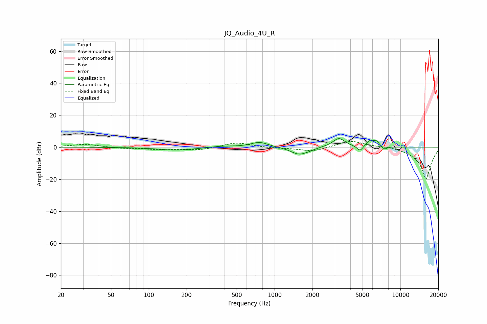

# JQ_Audio_4U_R
See [usage instructions](https://github.com/jaakkopasanen/AutoEq#usage) for more options and info.

### Parametric EQs
Apply preamp of -5.4 dB when using parametric equalizer.

|   # | Type    |   Fc (Hz) |    Q |   Gain (dB) |
|-----|---------|-----------|------|-------------|
|   1 | Peaking |       167 | 0.97 |        -1.9 |
|   2 | Peaking |       382 | 1.47 |         0.8 |
|   3 | Peaking |       759 | 2.12 |         3.3 |
|   4 | Peaking |      1561 | 2.17 |        -4.6 |
|   5 | Peaking |      1889 | 3.44 |        -0.7 |
|   6 | Peaking |      3240 | 2.89 |         5.7 |
|   7 | Peaking |      4781 | 5.87 |        -3.5 |
|   8 | Peaking |      5715 | 4.63 |         3.8 |
|   9 | Peaking |      6446 | 6    |         3   |
|  10 | Peaking |      7447 | 5.98 |        -2   |

### Fixed Band EQs
When using fixed band (also called graphic) equalizer, apply preamp of **-3.7 dB** (if available) and set gains manually with these parameters.

|   # | Type    |   Fc (Hz) |    Q |   Gain (dB) |
|-----|---------|-----------|------|-------------|
|   1 | Peaking |        31 | 1.41 |         1.9 |
|   2 | Peaking |        62 | 1.41 |        -0.7 |
|   3 | Peaking |       125 | 1.41 |        -1.4 |
|   4 | Peaking |       250 | 1.41 |        -1.7 |
|   5 | Peaking |       500 | 1.41 |         3   |
|   6 | Peaking |      1000 | 1.41 |        -0.5 |
|   7 | Peaking |      2000 | 1.41 |        -2.7 |
|   8 | Peaking |      4000 | 1.41 |         4.3 |
|   9 | Peaking |      8000 | 1.41 |         0.9 |
|  10 | Peaking |     16000 | 1.41 |       -20   |

### Graphs

