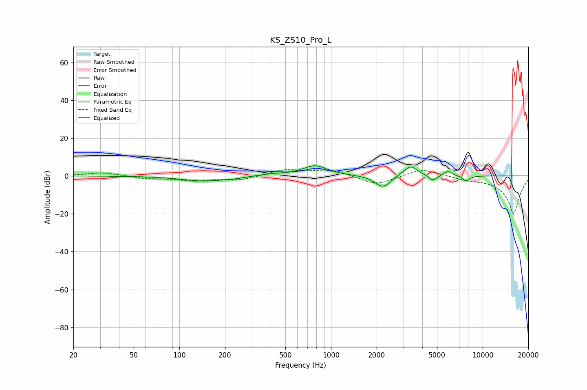

# KS_ZS10_Pro_L
See [usage instructions](https://github.com/jaakkopasanen/AutoEq#usage) for more options and info.

### Parametric EQs
Apply preamp of -5.5 dB when using parametric equalizer.

|   # | Type    |   Fc (Hz) |    Q |   Gain (dB) |
|-----|---------|-----------|------|-------------|
|   1 | Peaking |       146 | 0.96 |        -2.7 |
|   2 | Peaking |       231 | 2.76 |        -0.5 |
|   3 | Peaking |       406 | 1.61 |         0.9 |
|   4 | Peaking |       784 | 1.75 |         5.4 |
|   5 | Peaking |      2155 | 2.93 |        -5.6 |
|   6 | Peaking |      2369 | 5    |        -1.1 |
|   7 | Peaking |      3345 | 3.25 |         5.5 |
|   8 | Peaking |      4707 | 5.41 |        -3   |
|   9 | Peaking |      5910 | 5.14 |         2.6 |
|  10 | Peaking |      7807 | 5.91 |        -2.8 |

### Fixed Band EQs
When using fixed band (also called graphic) equalizer, apply preamp of **-3.4 dB** (if available) and set gains manually with these parameters.

|   # | Type    |   Fc (Hz) |    Q |   Gain (dB) |
|-----|---------|-----------|------|-------------|
|   1 | Peaking |        31 | 1.41 |         1.8 |
|   2 | Peaking |        62 | 1.41 |        -1.3 |
|   3 | Peaking |       125 | 1.41 |        -2.3 |
|   4 | Peaking |       250 | 1.41 |        -2.1 |
|   5 | Peaking |       500 | 1.41 |         3.3 |
|   6 | Peaking |      1000 | 1.41 |         3.4 |
|   7 | Peaking |      2000 | 1.41 |        -5   |
|   8 | Peaking |      4000 | 1.41 |         4.1 |
|   9 | Peaking |      8000 | 1.41 |        -1.3 |
|  10 | Peaking |     16000 | 1.41 |       -20   |

### Graphs

