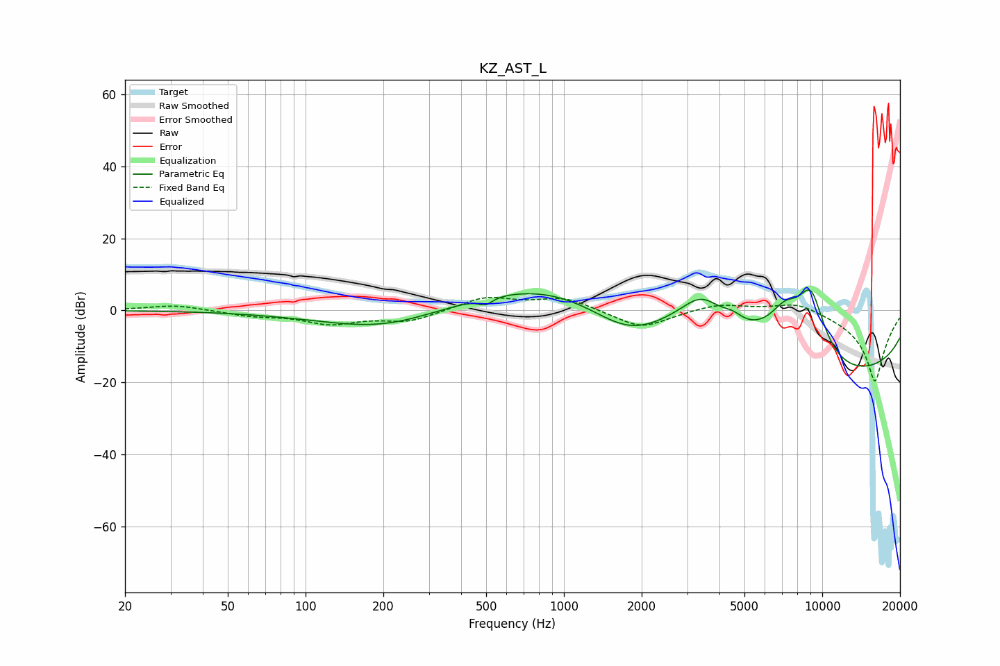

# KZ_AST_L
See [usage instructions](https://github.com/jaakkopasanen/AutoEq#usage) for more options and info.

### Parametric EQs
Apply preamp of -5.7 dB when using parametric equalizer.

|   # | Type    |   Fc (Hz) |    Q |   Gain (dB) |
|-----|---------|-----------|------|-------------|
|   1 | Peaking |       205 | 0.57 |        -6.4 |
|   2 | Peaking |       498 | 5.55 |        -1.8 |
|   3 | Peaking |      1015 | 0.36 |        12.2 |
|   4 | Peaking |      1762 | 0.82 |        -9.2 |
|   5 | Peaking |      3400 | 1.22 |        13   |
|   6 | Peaking |      4511 | 3.77 |         1.9 |
|   7 | Peaking |      7182 | 1.62 |        12   |
|   8 | Peaking |      9054 | 2.41 |         8.2 |
|   9 | Peaking |      9060 | 2.21 |         8.9 |
|  10 | Peaking |     10000 | 0.18 |       -20   |

### Fixed Band EQs
When using fixed band (also called graphic) equalizer, apply preamp of **-3.7 dB** (if available) and set gains manually with these parameters.

|   # | Type    |   Fc (Hz) |    Q |   Gain (dB) |
|-----|---------|-----------|------|-------------|
|   1 | Peaking |        31 | 1.41 |         1.5 |
|   2 | Peaking |        62 | 1.41 |        -1.4 |
|   3 | Peaking |       125 | 1.41 |        -3.4 |
|   4 | Peaking |       250 | 1.41 |        -3   |
|   5 | Peaking |       500 | 1.41 |         3.7 |
|   6 | Peaking |      1000 | 1.41 |         3.5 |
|   7 | Peaking |      2000 | 1.41 |        -5.2 |
|   8 | Peaking |      4000 | 1.41 |         2   |
|   9 | Peaking |      8000 | 1.41 |         2.9 |
|  10 | Peaking |     16000 | 1.41 |       -20   |

### Graphs

