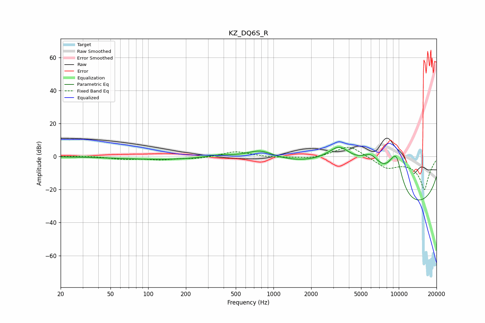

# KZ_DQ6S_R
See [usage instructions](https://github.com/jaakkopasanen/AutoEq#usage) for more options and info.

### Parametric EQs
Apply preamp of -5.7 dB when using parametric equalizer.

|   # | Type    |   Fc (Hz) |    Q |   Gain (dB) |
|-----|---------|-----------|------|-------------|
|   1 | Peaking |       142 | 0.37 |        -1.9 |
|   2 | Peaking |       362 | 1.24 |         1.8 |
|   3 | Peaking |       785 | 1.33 |         5.3 |
|   4 | Peaking |      3346 | 0.86 |        20   |
|   5 | Peaking |      6010 | 0.96 |        20   |
|   6 | Peaking |      8949 | 1.59 |        12.2 |
|   7 | Peaking |      9630 | 2.9  |         6.7 |
|   8 | Peaking |      9635 | 2.95 |         6.6 |
|   9 | Peaking |     10000 | 0.24 |       -17.4 |
|  10 | Peaking |     10000 | 0.19 |       -20   |

### Fixed Band EQs
When using fixed band (also called graphic) equalizer, apply preamp of **-5.7 dB** (if available) and set gains manually with these parameters.

|   # | Type    |   Fc (Hz) |    Q |   Gain (dB) |
|-----|---------|-----------|------|-------------|
|   1 | Peaking |        31 | 1.41 |         0.4 |
|   2 | Peaking |        62 | 1.41 |        -1.5 |
|   3 | Peaking |       125 | 1.41 |        -1.7 |
|   4 | Peaking |       250 | 1.41 |        -1.2 |
|   5 | Peaking |       500 | 1.41 |         3.2 |
|   6 | Peaking |      1000 | 1.41 |        -0.6 |
|   7 | Peaking |      2000 | 1.41 |        -1.4 |
|   8 | Peaking |      4000 | 1.41 |         7.1 |
|   9 | Peaking |      8000 | 1.41 |        -6.3 |
|  10 | Peaking |     16000 | 1.41 |       -20   |

### Graphs

