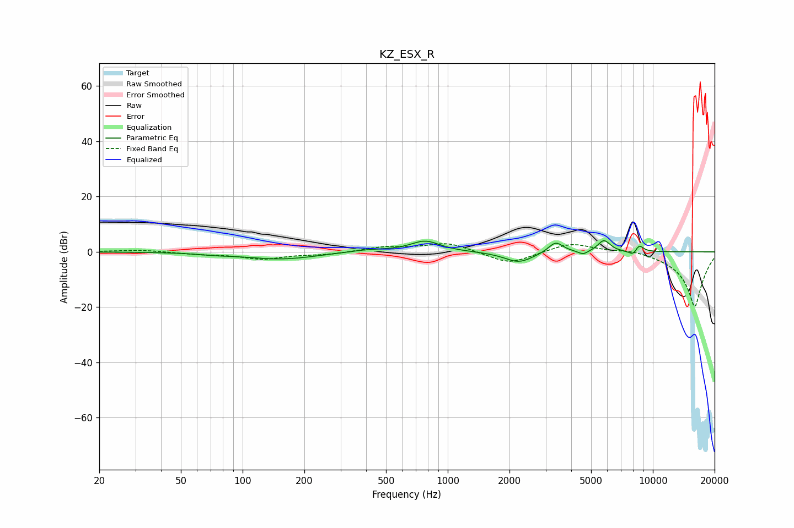

# KZ_ESX_R
See [usage instructions](https://github.com/jaakkopasanen/AutoEq#usage) for more options and info.

### Parametric EQs
Apply preamp of -4.1 dB when using parametric equalizer.

|   # | Type    |   Fc (Hz) |    Q |   Gain (dB) |
|-----|---------|-----------|------|-------------|
|   1 | Peaking |        73 | 1.95 |        -0.5 |
|   2 | Peaking |       154 | 0.79 |        -2.7 |
|   3 | Peaking |       400 | 1.28 |         0.9 |
|   4 | Peaking |       777 | 1.97 |         3.9 |
|   5 | Peaking |      2223 | 2.01 |        -3.9 |
|   6 | Peaking |      3358 | 3.91 |         4   |
|   7 | Peaking |      4575 | 5.59 |        -1.5 |
|   8 | Peaking |      5776 | 4.63 |         4.2 |
|   9 | Peaking |      8069 | 5.83 |        -2.3 |
|  10 | Peaking |      8540 | 6    |         3.1 |

### Fixed Band EQs
When using fixed band (also called graphic) equalizer, apply preamp of **-3.0 dB** (if available) and set gains manually with these parameters.

|   # | Type    |   Fc (Hz) |    Q |   Gain (dB) |
|-----|---------|-----------|------|-------------|
|   1 | Peaking |        31 | 1.41 |         0.7 |
|   2 | Peaking |        62 | 1.41 |        -0.8 |
|   3 | Peaking |       125 | 1.41 |        -2.5 |
|   4 | Peaking |       250 | 1.41 |        -0.9 |
|   5 | Peaking |       500 | 1.41 |         1.7 |
|   6 | Peaking |      1000 | 1.41 |         3.3 |
|   7 | Peaking |      2000 | 1.41 |        -4.6 |
|   8 | Peaking |      4000 | 1.41 |         3.5 |
|   9 | Peaking |      8000 | 1.41 |         1.2 |
|  10 | Peaking |     16000 | 1.41 |       -20   |

### Graphs

