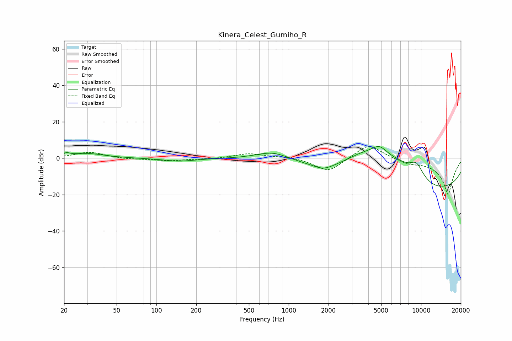

# Kinera_Celest_Gumiho_R
See [usage instructions](https://github.com/jaakkopasanen/AutoEq#usage) for more options and info.

### Parametric EQs
Apply preamp of -6.5 dB when using parametric equalizer.

|   # | Type    |   Fc (Hz) |    Q |   Gain (dB) |
|-----|---------|-----------|------|-------------|
|   1 | Peaking |        21 | 5.84 |         1.5 |
|   2 | Peaking |        30 | 1.12 |         2.6 |
|   3 | Peaking |       148 | 1.22 |        -1.7 |
|   4 | Peaking |       762 | 1.07 |         5.3 |
|   5 | Peaking |      1838 | 1.88 |        -3.1 |
|   6 | Peaking |      3558 | 0.84 |        10.7 |
|   7 | Peaking |      4846 | 1.93 |         8.3 |
|   8 | Peaking |      6646 | 0.95 |         8.7 |
|   9 | Peaking |      9234 | 2.14 |         9.2 |
|  10 | Peaking |     10000 | 0.18 |       -20   |

### Fixed Band EQs
When using fixed band (also called graphic) equalizer, apply preamp of **-6.5 dB** (if available) and set gains manually with these parameters.

|   # | Type    |   Fc (Hz) |    Q |   Gain (dB) |
|-----|---------|-----------|------|-------------|
|   1 | Peaking |        31 | 1.41 |         3.4 |
|   2 | Peaking |        62 | 1.41 |        -0.6 |
|   3 | Peaking |       125 | 1.41 |        -1.4 |
|   4 | Peaking |       250 | 1.41 |        -0.4 |
|   5 | Peaking |       500 | 1.41 |         2.6 |
|   6 | Peaking |      1000 | 1.41 |         1   |
|   7 | Peaking |      2000 | 1.41 |        -7.9 |
|   8 | Peaking |      4000 | 1.41 |         8.5 |
|   9 | Peaking |      8000 | 1.41 |        -2.4 |
|  10 | Peaking |     16000 | 1.41 |       -20   |

### Graphs

