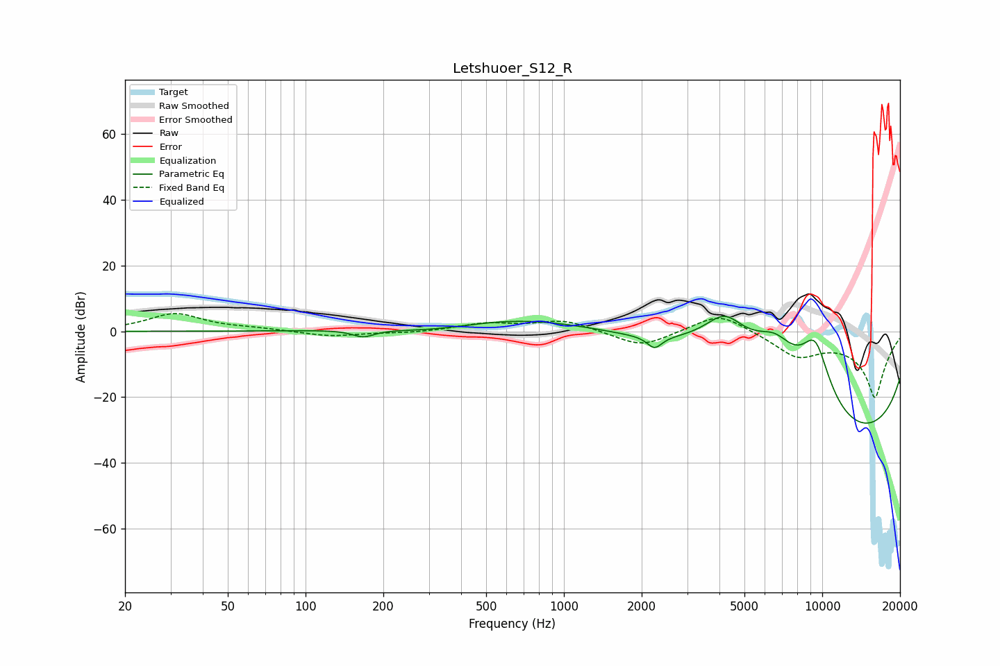

# Letshuoer_S12_R
See [usage instructions](https://github.com/jaakkopasanen/AutoEq#usage) for more options and info.

### Parametric EQs
Apply preamp of -4.6 dB when using parametric equalizer.

|   # | Type    |   Fc (Hz) |    Q |   Gain (dB) |
|-----|---------|-----------|------|-------------|
|   1 | Peaking |       167 | 3.38 |        -2.2 |
|   2 | Peaking |       323 | 0.72 |        -3   |
|   3 | Peaking |      1695 | 0.2  |        10.4 |
|   4 | Peaking |      2243 | 5.06 |        -3.7 |
|   5 | Peaking |      4187 | 1.04 |        18.1 |
|   6 | Peaking |      6571 | 1.21 |        14.2 |
|   7 | Peaking |      9345 | 1.62 |        12.1 |
|   8 | Peaking |      9442 | 2.42 |         8.1 |
|   9 | Peaking |     10000 | 0.18 |       -20   |
|  10 | Peaking |     10000 | 0.18 |       -18   |

### Fixed Band EQs
When using fixed band (also called graphic) equalizer, apply preamp of **-5.5 dB** (if available) and set gains manually with these parameters.

|   # | Type    |   Fc (Hz) |    Q |   Gain (dB) |
|-----|---------|-----------|------|-------------|
|   1 | Peaking |        31 | 1.41 |         5.3 |
|   2 | Peaking |        62 | 1.41 |         0.7 |
|   3 | Peaking |       125 | 1.41 |        -1.6 |
|   4 | Peaking |       250 | 1.41 |        -0.5 |
|   5 | Peaking |       500 | 1.41 |         2.2 |
|   6 | Peaking |      1000 | 1.41 |         3.4 |
|   7 | Peaking |      2000 | 1.41 |        -5   |
|   8 | Peaking |      4000 | 1.41 |         6.1 |
|   9 | Peaking |      8000 | 1.41 |        -6.9 |
|  10 | Peaking |     16000 | 1.41 |       -20   |

### Graphs

