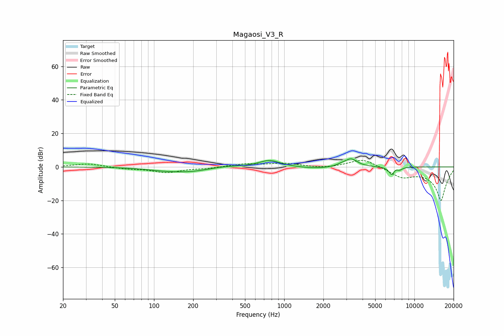

# Magaosi_V3_R
See [usage instructions](https://github.com/jaakkopasanen/AutoEq#usage) for more options and info.

### Parametric EQs
Apply preamp of -4.9 dB when using parametric equalizer.

|   # | Type    |   Fc (Hz) |    Q |   Gain (dB) |
|-----|---------|-----------|------|-------------|
|   1 | Peaking |       112 | 1.13 |        -0.7 |
|   2 | Peaking |       183 | 0.76 |        -2.9 |
|   3 | Peaking |       342 | 1.14 |         1.1 |
|   4 | Peaking |       770 | 1.72 |         4.1 |
|   5 | Peaking |      1752 | 1.03 |        -1.1 |
|   6 | Peaking |      2750 | 3.9  |         0.9 |
|   7 | Peaking |      3264 | 2.99 |         4.8 |
|   8 | Peaking |      6735 | 5.95 |        -5.4 |
|   9 | Peaking |      7089 | 6    |         1.7 |
|  10 | Peaking |      7659 | 5.98 |        -1.6 |

### Fixed Band EQs
When using fixed band (also called graphic) equalizer, apply preamp of **-4.0 dB** (if available) and set gains manually with these parameters.

|   # | Type    |   Fc (Hz) |    Q |   Gain (dB) |
|-----|---------|-----------|------|-------------|
|   1 | Peaking |        31 | 1.41 |         2   |
|   2 | Peaking |        62 | 1.41 |        -1.1 |
|   3 | Peaking |       125 | 1.41 |        -3.2 |
|   4 | Peaking |       250 | 1.41 |        -0.8 |
|   5 | Peaking |       500 | 1.41 |         1.7 |
|   6 | Peaking |      1000 | 1.41 |         2   |
|   7 | Peaking |      2000 | 1.41 |        -0.9 |
|   8 | Peaking |      4000 | 1.41 |         5.1 |
|   9 | Peaking |      8000 | 1.41 |        -5.4 |
|  10 | Peaking |     16000 | 1.41 |       -20   |

### Graphs

