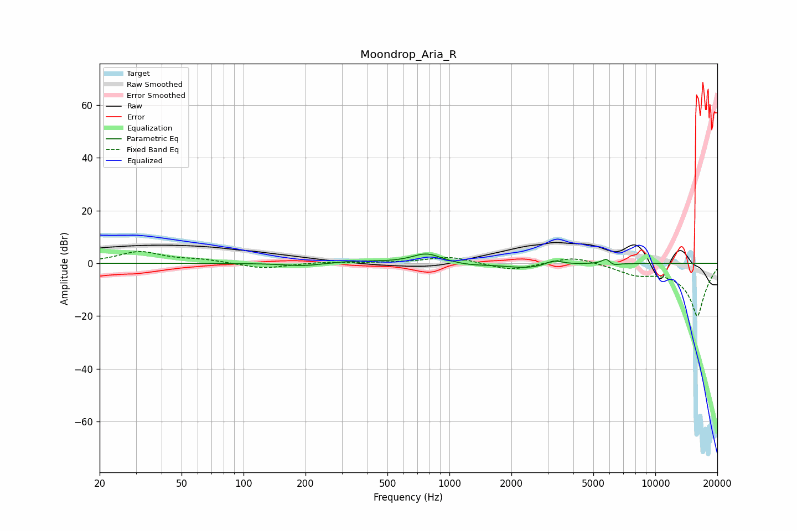

# Moondrop_Aria_R
See [usage instructions](https://github.com/jaakkopasanen/AutoEq#usage) for more options and info.

### Parametric EQs
Apply preamp of -3.6 dB when using parametric equalizer.

|   # | Type    |   Fc (Hz) |    Q |   Gain (dB) |
|-----|---------|-----------|------|-------------|
|   1 | Peaking |       194 | 1.5  |        -1   |
|   2 | Peaking |       227 | 1.16 |        -0.2 |
|   3 | Peaking |       336 | 1.09 |         0.9 |
|   4 | Peaking |       770 | 2.04 |         3.4 |
|   5 | Peaking |       831 | 1.91 |         0.4 |
|   6 | Peaking |      1245 | 1.71 |        -0.8 |
|   7 | Peaking |      2394 | 1.3  |        -1.8 |
|   8 | Peaking |      3221 | 3.48 |         1.9 |
|   9 | Peaking |      5813 | 6    |         2.6 |
|  10 | Peaking |      6164 | 4.95 |        -1.5 |

### Fixed Band EQs
When using fixed band (also called graphic) equalizer, apply preamp of **-4.5 dB** (if available) and set gains manually with these parameters.

|   # | Type    |   Fc (Hz) |    Q |   Gain (dB) |
|-----|---------|-----------|------|-------------|
|   1 | Peaking |        31 | 1.41 |         4.3 |
|   2 | Peaking |        62 | 1.41 |         1.2 |
|   3 | Peaking |       125 | 1.41 |        -2.1 |
|   4 | Peaking |       250 | 1.41 |         0.5 |
|   5 | Peaking |       500 | 1.41 |         0.1 |
|   6 | Peaking |      1000 | 1.41 |         2.6 |
|   7 | Peaking |      2000 | 1.41 |        -2.8 |
|   8 | Peaking |      4000 | 1.41 |         2.9 |
|   9 | Peaking |      8000 | 1.41 |        -3.3 |
|  10 | Peaking |     16000 | 1.41 |       -20   |

### Graphs

