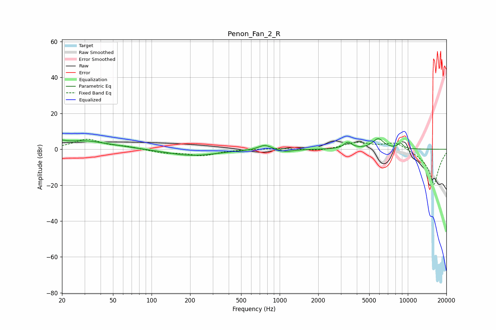

# Penon_Fan_2_R
See [usage instructions](https://github.com/jaakkopasanen/AutoEq#usage) for more options and info.

### Parametric EQs
Apply preamp of -6.0 dB when using parametric equalizer.

|   # | Type    |   Fc (Hz) |    Q |   Gain (dB) |
|-----|---------|-----------|------|-------------|
|   1 | Peaking |        20 | 6    |         3.8 |
|   2 | Peaking |        20 | 5.97 |        -2.8 |
|   3 | Peaking |        26 | 0.5  |         4.3 |
|   4 | Peaking |        32 | 1.5  |         0.7 |
|   5 | Peaking |       206 | 0.7  |        -3.6 |
|   6 | Peaking |       765 | 2.85 |         2.9 |
|   7 | Peaking |      1116 | 2.51 |        -1.4 |
|   8 | Peaking |      3406 | 4.54 |         3.6 |
|   9 | Peaking |      5880 | 3.22 |         5.7 |
|  10 | Peaking |      8753 | 6    |         2.9 |

### Fixed Band EQs
When using fixed band (also called graphic) equalizer, apply preamp of **-5.7 dB** (if available) and set gains manually with these parameters.

|   # | Type    |   Fc (Hz) |    Q |   Gain (dB) |
|-----|---------|-----------|------|-------------|
|   1 | Peaking |        31 | 1.41 |         5.5 |
|   2 | Peaking |        62 | 1.41 |         1.2 |
|   3 | Peaking |       125 | 1.41 |        -1.9 |
|   4 | Peaking |       250 | 1.41 |        -3.4 |
|   5 | Peaking |       500 | 1.41 |         0   |
|   6 | Peaking |      1000 | 1.41 |         0.6 |
|   7 | Peaking |      2000 | 1.41 |        -1   |
|   8 | Peaking |      4000 | 1.41 |         3.8 |
|   9 | Peaking |      8000 | 1.41 |         4.6 |
|  10 | Peaking |     16000 | 1.41 |       -20   |

### Graphs

