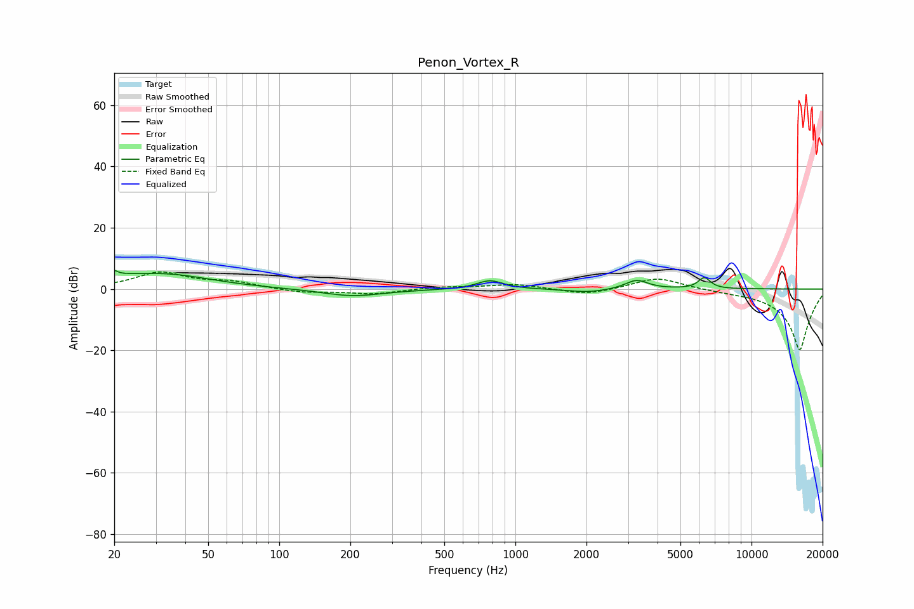

# Penon_Vortex_R
See [usage instructions](https://github.com/jaakkopasanen/AutoEq#usage) for more options and info.

### Parametric EQs
Apply preamp of -6.2 dB when using parametric equalizer.

|   # | Type    |   Fc (Hz) |    Q |   Gain (dB) |
|-----|---------|-----------|------|-------------|
|   1 | Peaking |        20 | 5.99 |         4.9 |
|   2 | Peaking |        20 | 6    |        -3   |
|   3 | Peaking |        26 | 0.61 |         4.3 |
|   4 | Peaking |        39 | 0.98 |         1.1 |
|   5 | Peaking |       203 | 1.15 |        -2.1 |
|   6 | Peaking |       224 | 0.71 |        -0.3 |
|   7 | Peaking |       781 | 2.56 |         2.9 |
|   8 | Peaking |      2035 | 1.63 |        -1.2 |
|   9 | Peaking |      3260 | 2.97 |         3   |
|  10 | Peaking |      6314 | 5.32 |         3.6 |

### Fixed Band EQs
When using fixed band (also called graphic) equalizer, apply preamp of **-5.7 dB** (if available) and set gains manually with these parameters.

|   # | Type    |   Fc (Hz) |    Q |   Gain (dB) |
|-----|---------|-----------|------|-------------|
|   1 | Peaking |        31 | 1.41 |         5.2 |
|   2 | Peaking |        62 | 1.41 |         2   |
|   3 | Peaking |       125 | 1.41 |        -1.2 |
|   4 | Peaking |       250 | 1.41 |        -1.6 |
|   5 | Peaking |       500 | 1.41 |         0.7 |
|   6 | Peaking |      1000 | 1.41 |         1.6 |
|   7 | Peaking |      2000 | 1.41 |        -2   |
|   8 | Peaking |      4000 | 1.41 |         3.9 |
|   9 | Peaking |      8000 | 1.41 |        -0.4 |
|  10 | Peaking |     16000 | 1.41 |       -20   |

### Graphs

