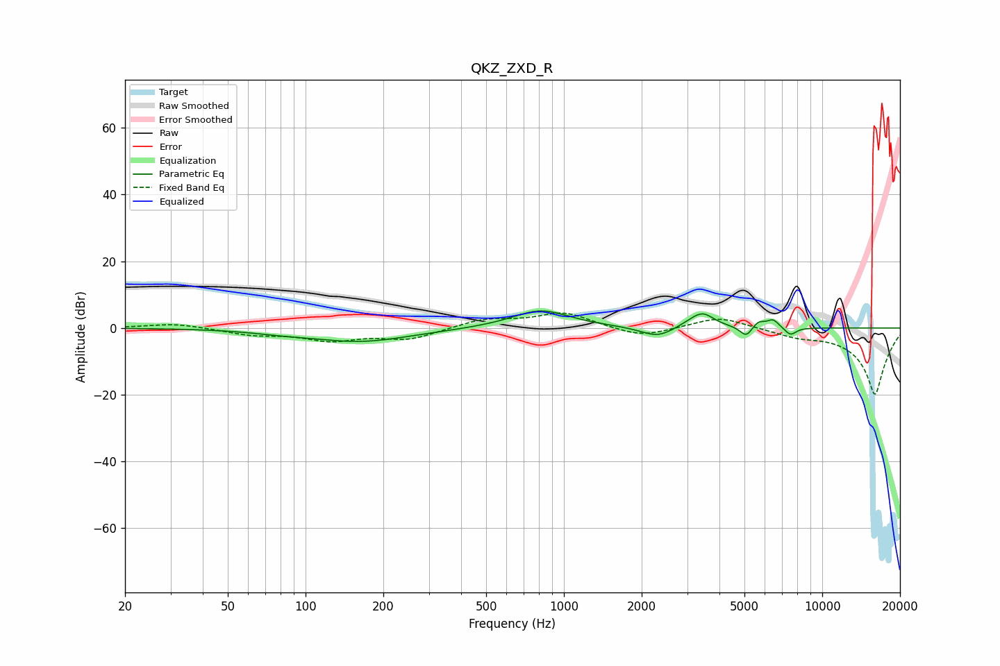

# QKZ_ZXD_R
See [usage instructions](https://github.com/jaakkopasanen/AutoEq#usage) for more options and info.

### Parametric EQs
Apply preamp of -5.2 dB when using parametric equalizer.

|   # | Type    |   Fc (Hz) |    Q |   Gain (dB) |
|-----|---------|-----------|------|-------------|
|   1 | Peaking |        80 | 1.28 |        -0.6 |
|   2 | Peaking |       163 | 0.71 |        -4   |
|   3 | Peaking |       813 | 1.25 |         5.5 |
|   4 | Peaking |      2307 | 2.19 |        -3.2 |
|   5 | Peaking |      3108 | 2.51 |         1.2 |
|   6 | Peaking |      3449 | 3.17 |         3.9 |
|   7 | Peaking |      5081 | 5.84 |        -3.2 |
|   8 | Peaking |      5669 | 5.83 |         2   |
|   9 | Peaking |      6451 | 6    |         2.4 |
|  10 | Peaking |      7534 | 5.97 |        -2.4 |

### Fixed Band EQs
When using fixed band (also called graphic) equalizer, apply preamp of **-4.6 dB** (if available) and set gains manually with these parameters.

|   # | Type    |   Fc (Hz) |    Q |   Gain (dB) |
|-----|---------|-----------|------|-------------|
|   1 | Peaking |        31 | 1.41 |         1.4 |
|   2 | Peaking |        62 | 1.41 |        -1.8 |
|   3 | Peaking |       125 | 1.41 |        -3.4 |
|   4 | Peaking |       250 | 1.41 |        -3.3 |
|   5 | Peaking |       500 | 1.41 |         2.6 |
|   6 | Peaking |      1000 | 1.41 |         4.5 |
|   7 | Peaking |      2000 | 1.41 |        -2.9 |
|   8 | Peaking |      4000 | 1.41 |         3.6 |
|   9 | Peaking |      8000 | 1.41 |        -1.8 |
|  10 | Peaking |     16000 | 1.41 |       -20   |

### Graphs

