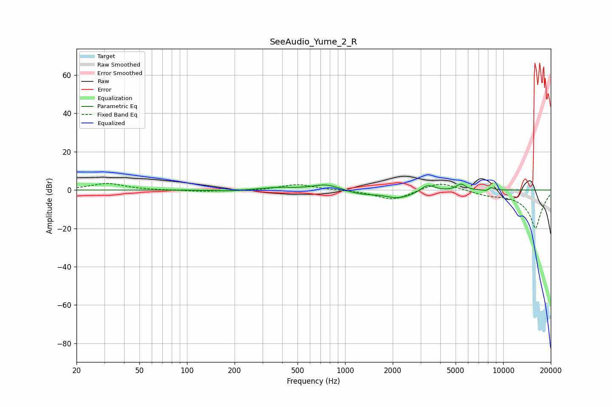

# SeeAudio_Yume_2_R
See [usage instructions](https://github.com/jaakkopasanen/AutoEq#usage) for more options and info.

### Parametric EQs
Apply preamp of -3.2 dB when using parametric equalizer.

|   # | Type    |   Fc (Hz) |    Q |   Gain (dB) |
|-----|---------|-----------|------|-------------|
|   1 | Peaking |       184 | 1.67 |        -0.6 |
|   2 | Peaking |       374 | 1.34 |         1.2 |
|   3 | Peaking |       762 | 1.68 |         3.2 |
|   4 | Peaking |      1252 | 1.56 |        -1.8 |
|   5 | Peaking |      2069 | 3.33 |        -0.6 |
|   6 | Peaking |      2310 | 1.22 |        -3.8 |
|   7 | Peaking |      3313 | 2.92 |         4.2 |
|   8 | Peaking |      5403 | 4.74 |         3.3 |
|   9 | Peaking |      8009 | 5.96 |        -2.1 |
|  10 | Peaking |      8247 | 6    |         2.8 |

### Fixed Band EQs
When using fixed band (also called graphic) equalizer, apply preamp of **-3.5 dB** (if available) and set gains manually with these parameters.

|   # | Type    |   Fc (Hz) |    Q |   Gain (dB) |
|-----|---------|-----------|------|-------------|
|   1 | Peaking |        31 | 1.41 |         3.4 |
|   2 | Peaking |        62 | 1.41 |        -0.1 |
|   3 | Peaking |       125 | 1.41 |        -0.7 |
|   4 | Peaking |       250 | 1.41 |        -0.4 |
|   5 | Peaking |       500 | 1.41 |         3.1 |
|   6 | Peaking |      1000 | 1.41 |        -0.1 |
|   7 | Peaking |      2000 | 1.41 |        -5.3 |
|   8 | Peaking |      4000 | 1.41 |         4.6 |
|   9 | Peaking |      8000 | 1.41 |        -1.9 |
|  10 | Peaking |     16000 | 1.41 |       -20   |

### Graphs

