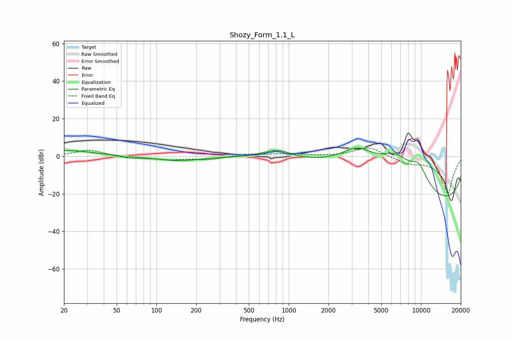

# Shozy_Form_1.1_L
See [usage instructions](https://github.com/jaakkopasanen/AutoEq#usage) for more options and info.

### Parametric EQs
Apply preamp of -4.5 dB when using parametric equalizer.

|   # | Type    |   Fc (Hz) |    Q |   Gain (dB) |
|-----|---------|-----------|------|-------------|
|   1 | Peaking |        21 | 0.73 |         3.1 |
|   2 | Peaking |        57 | 5.85 |        -0.5 |
|   3 | Peaking |       108 | 2.42 |         0.3 |
|   4 | Peaking |       139 | 0.79 |        -2.5 |
|   5 | Peaking |       822 | 1.26 |         4.9 |
|   6 | Peaking |      3314 | 0.67 |        18   |
|   7 | Peaking |      6421 | 0.74 |        19   |
|   8 | Peaking |      9585 | 1.5  |        13.1 |
|   9 | Peaking |      9595 | 0.18 |       -19.5 |
|  10 | Peaking |      9599 | 0.18 |       -13   |

### Fixed Band EQs
When using fixed band (also called graphic) equalizer, apply preamp of **-4.5 dB** (if available) and set gains manually with these parameters.

|   # | Type    |   Fc (Hz) |    Q |   Gain (dB) |
|-----|---------|-----------|------|-------------|
|   1 | Peaking |        31 | 1.41 |         3.5 |
|   2 | Peaking |        62 | 1.41 |        -1.3 |
|   3 | Peaking |       125 | 1.41 |        -1.6 |
|   4 | Peaking |       250 | 1.41 |        -1.7 |
|   5 | Peaking |       500 | 1.41 |         1.2 |
|   6 | Peaking |      1000 | 1.41 |         1.2 |
|   7 | Peaking |      2000 | 1.41 |        -0   |
|   8 | Peaking |      4000 | 1.41 |         5.1 |
|   9 | Peaking |      8000 | 1.41 |        -3.1 |
|  10 | Peaking |     16000 | 1.41 |       -20   |

### Graphs

