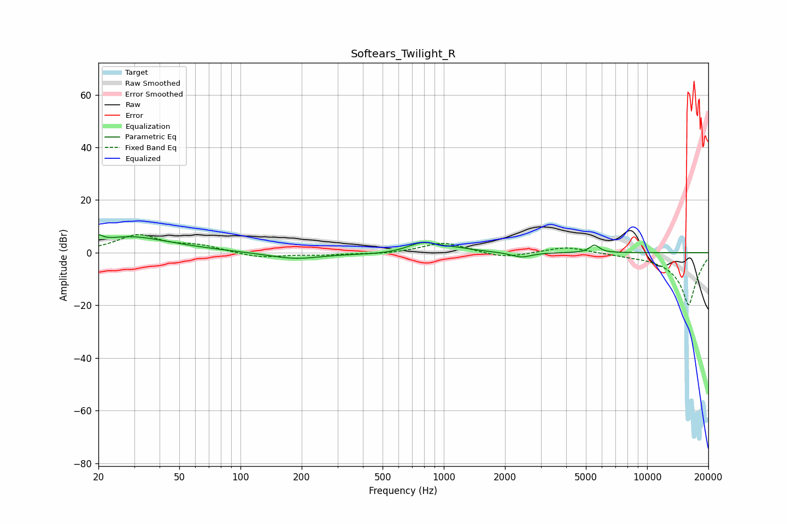

# Softears_Twilight_R
See [usage instructions](https://github.com/jaakkopasanen/AutoEq#usage) for more options and info.

### Parametric EQs
Apply preamp of -6.9 dB when using parametric equalizer.

|   # | Type    |   Fc (Hz) |    Q |   Gain (dB) |
|-----|---------|-----------|------|-------------|
|   1 | Peaking |        20 | 5.96 |         5.6 |
|   2 | Peaking |        20 | 6    |        -3.1 |
|   3 | Peaking |        29 | 1.38 |         1.2 |
|   4 | Peaking |        30 | 0.62 |         4.8 |
|   5 | Peaking |       185 | 1.07 |        -2.5 |
|   6 | Peaking |       520 | 0.98 |        -0.7 |
|   7 | Peaking |       786 | 1.85 |         3.9 |
|   8 | Peaking |      1157 | 1.59 |         1.2 |
|   9 | Peaking |      2408 | 2.9  |        -1.9 |
|  10 | Peaking |      5511 | 5.85 |         2.9 |

### Fixed Band EQs
When using fixed band (also called graphic) equalizer, apply preamp of **-7.0 dB** (if available) and set gains manually with these parameters.

|   # | Type    |   Fc (Hz) |    Q |   Gain (dB) |
|-----|---------|-----------|------|-------------|
|   1 | Peaking |        31 | 1.41 |         6.5 |
|   2 | Peaking |        62 | 1.41 |         2.3 |
|   3 | Peaking |       125 | 1.41 |        -2   |
|   4 | Peaking |       250 | 1.41 |        -0.8 |
|   5 | Peaking |       500 | 1.41 |        -0.6 |
|   6 | Peaking |      1000 | 1.41 |         4   |
|   7 | Peaking |      2000 | 1.41 |        -2.2 |
|   8 | Peaking |      4000 | 1.41 |         2.5 |
|   9 | Peaking |      8000 | 1.41 |        -0.4 |
|  10 | Peaking |     16000 | 1.41 |       -20   |

### Graphs

