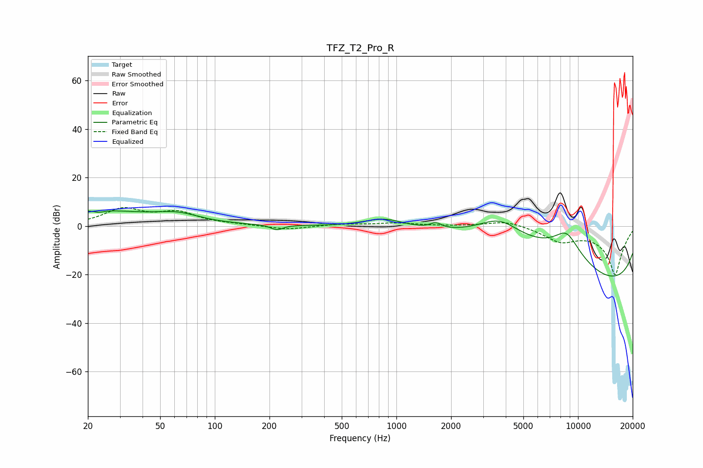

# TFZ_T2_Pro_R
See [usage instructions](https://github.com/jaakkopasanen/AutoEq#usage) for more options and info.

### Parametric EQs
Apply preamp of -6.3 dB when using parametric equalizer.

|   # | Type    |   Fc (Hz) |    Q |   Gain (dB) |
|-----|---------|-----------|------|-------------|
|   1 | Peaking |        21 | 0.46 |         6.2 |
|   2 | Peaking |        23 | 5.25 |        -0.9 |
|   3 | Peaking |        63 | 1.2  |         3.2 |
|   4 | Peaking |       219 | 4.4  |        -2.1 |
|   5 | Peaking |       859 | 1.26 |         3.9 |
|   6 | Peaking |      1648 | 4.51 |         2.3 |
|   7 | Peaking |      3694 | 0.58 |        20   |
|   8 | Peaking |      8637 | 0.97 |        20   |
|   9 | Peaking |     10000 | 0.18 |       -11.8 |
|  10 | Peaking |     10000 | 0.18 |       -19.8 |

### Fixed Band EQs
When using fixed band (also called graphic) equalizer, apply preamp of **-7.7 dB** (if available) and set gains manually with these parameters.

|   # | Type    |   Fc (Hz) |    Q |   Gain (dB) |
|-----|---------|-----------|------|-------------|
|   1 | Peaking |        31 | 1.41 |         6.6 |
|   2 | Peaking |        62 | 1.41 |         5.1 |
|   3 | Peaking |       125 | 1.41 |         0.4 |
|   4 | Peaking |       250 | 1.41 |        -1.6 |
|   5 | Peaking |       500 | 1.41 |         0.8 |
|   6 | Peaking |      1000 | 1.41 |         1.2 |
|   7 | Peaking |      2000 | 1.41 |        -0   |
|   8 | Peaking |      4000 | 1.41 |         2.4 |
|   9 | Peaking |      8000 | 1.41 |        -5.4 |
|  10 | Peaking |     16000 | 1.41 |       -20   |

### Graphs

