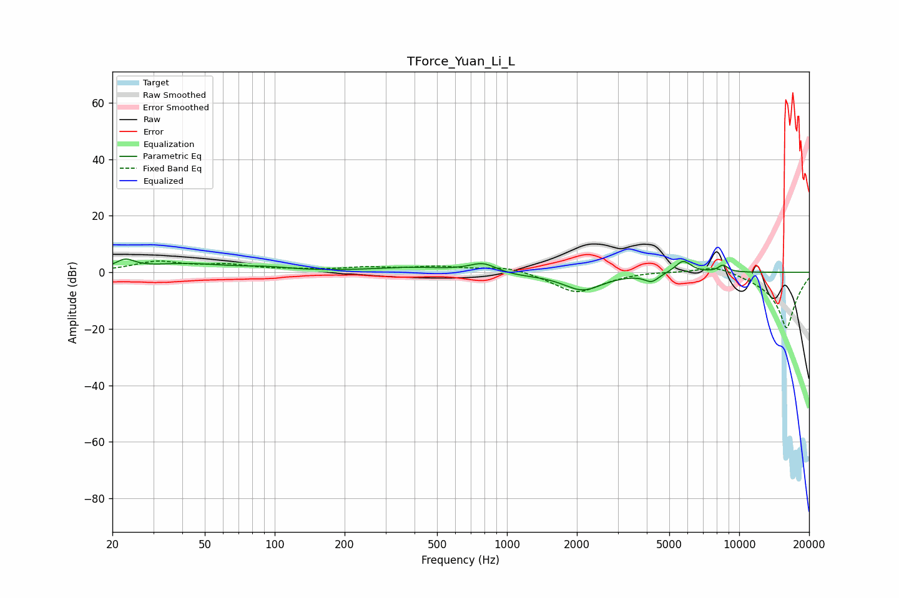

# TForce_Yuan_Li_L
See [usage instructions](https://github.com/jaakkopasanen/AutoEq#usage) for more options and info.

### Parametric EQs
Apply preamp of -4.8 dB when using parametric equalizer.

|   # | Type    |   Fc (Hz) |    Q |   Gain (dB) |
|-----|---------|-----------|------|-------------|
|   1 | Peaking |        23 | 3.51 |         3.2 |
|   2 | Peaking |        41 | 0.79 |         2.8 |
|   3 | Peaking |        92 | 1.41 |         1   |
|   4 | Peaking |       386 | 0.86 |         1.6 |
|   5 | Peaking |       790 | 2.38 |         3.4 |
|   6 | Peaking |      1071 | 1.42 |        -0.9 |
|   7 | Peaking |      2120 | 1.63 |        -6.2 |
|   8 | Peaking |      4198 | 4.44 |        -2.9 |
|   9 | Peaking |      5731 | 3.99 |         4.4 |
|  10 | Peaking |      8522 | 6    |         2.4 |

### Fixed Band EQs
When using fixed band (also called graphic) equalizer, apply preamp of **-4.1 dB** (if available) and set gains manually with these parameters.

|   # | Type    |   Fc (Hz) |    Q |   Gain (dB) |
|-----|---------|-----------|------|-------------|
|   1 | Peaking |        31 | 1.41 |         3.5 |
|   2 | Peaking |        62 | 1.41 |         2.2 |
|   3 | Peaking |       125 | 1.41 |         0.6 |
|   4 | Peaking |       250 | 1.41 |         1.5 |
|   5 | Peaking |       500 | 1.41 |         1.8 |
|   6 | Peaking |      1000 | 1.41 |         2.2 |
|   7 | Peaking |      2000 | 1.41 |        -7.4 |
|   8 | Peaking |      4000 | 1.41 |         0.5 |
|   9 | Peaking |      8000 | 1.41 |         3.1 |
|  10 | Peaking |     16000 | 1.41 |       -20   |

### Graphs

