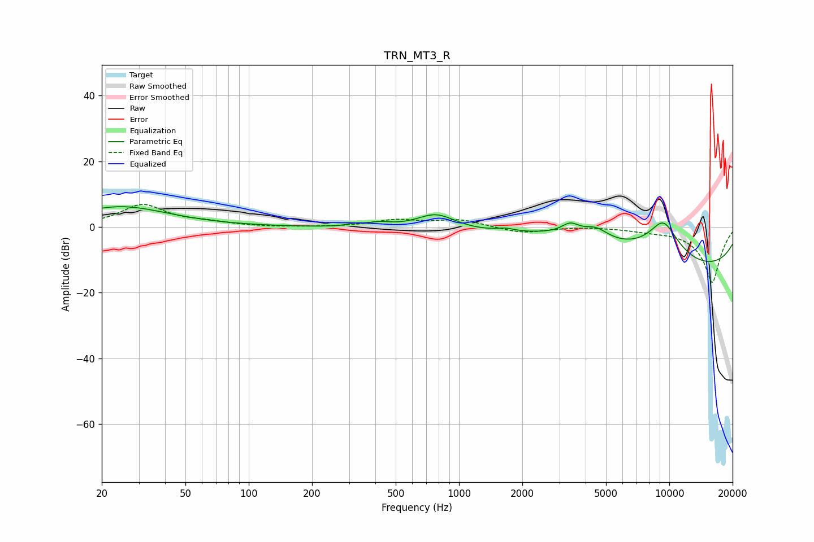

# TRN_MT3_R
See [usage instructions](https://github.com/jaakkopasanen/AutoEq#usage) for more options and info.

### Parametric EQs
Apply preamp of -6.3 dB when using parametric equalizer.

|   # | Type    |   Fc (Hz) |    Q |   Gain (dB) |
|-----|---------|-----------|------|-------------|
|   1 | Peaking |        25 | 0.63 |         6.2 |
|   2 | Peaking |       320 | 3.96 |         0.7 |
|   3 | Peaking |       418 | 2.54 |         1.2 |
|   4 | Peaking |       778 | 1.47 |         5.2 |
|   5 | Peaking |      1659 | 3.21 |         0.9 |
|   6 | Peaking |      3380 | 3.41 |         3   |
|   7 | Peaking |      3790 | 0.35 |        11.9 |
|   8 | Peaking |      4479 | 2.39 |         3.2 |
|   9 | Peaking |      7893 | 0.18 |       -20   |
|  10 | Peaking |      9362 | 1.37 |        14   |

### Fixed Band EQs
When using fixed band (also called graphic) equalizer, apply preamp of **-6.9 dB** (if available) and set gains manually with these parameters.

|   # | Type    |   Fc (Hz) |    Q |   Gain (dB) |
|-----|---------|-----------|------|-------------|
|   1 | Peaking |        31 | 1.41 |         6.7 |
|   2 | Peaking |        62 | 1.41 |         1.1 |
|   3 | Peaking |       125 | 1.41 |        -0.1 |
|   4 | Peaking |       250 | 1.41 |        -0.1 |
|   5 | Peaking |       500 | 1.41 |         2   |
|   6 | Peaking |      1000 | 1.41 |         2.2 |
|   7 | Peaking |      2000 | 1.41 |        -1.9 |
|   8 | Peaking |      4000 | 1.41 |         0.2 |
|   9 | Peaking |      8000 | 1.41 |        -0.7 |
|  10 | Peaking |     16000 | 1.41 |       -17   |

### Graphs

