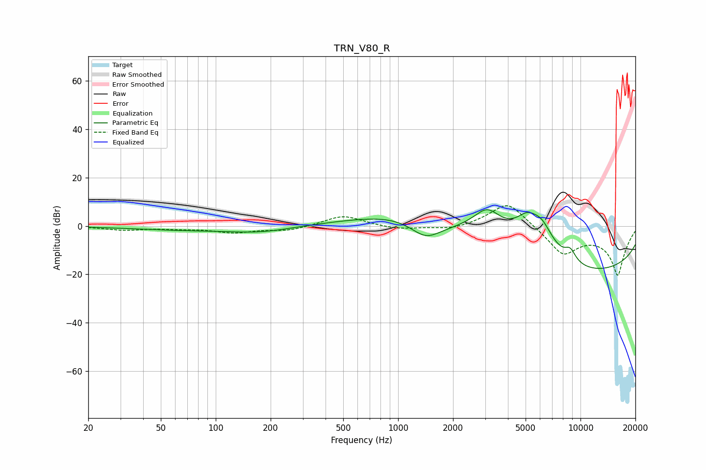

# TRN_V80_R
See [usage instructions](https://github.com/jaakkopasanen/AutoEq#usage) for more options and info.

### Parametric EQs
Apply preamp of -6.8 dB when using parametric equalizer.

|   # | Type    |   Fc (Hz) |    Q |   Gain (dB) |
|-----|---------|-----------|------|-------------|
|   1 | Peaking |        65 | 0.5  |        -1.5 |
|   2 | Peaking |       177 | 0.81 |        -2.3 |
|   3 | Peaking |      1166 | 0.52 |         9.4 |
|   4 | Peaking |      1412 | 1.47 |        -8.6 |
|   5 | Peaking |      3077 | 1.41 |        13.5 |
|   6 | Peaking |      5103 | 1.82 |        10.7 |
|   7 | Peaking |      5788 | 6    |         0.2 |
|   8 | Peaking |      6167 | 1.94 |        10   |
|   9 | Peaking |      8775 | 4.1  |         4.8 |
|  10 | Peaking |     10000 | 0.18 |       -20   |

### Fixed Band EQs
When using fixed band (also called graphic) equalizer, apply preamp of **-8.5 dB** (if available) and set gains manually with these parameters.

|   # | Type    |   Fc (Hz) |    Q |   Gain (dB) |
|-----|---------|-----------|------|-------------|
|   1 | Peaking |        31 | 1.41 |        -1.6 |
|   2 | Peaking |        62 | 1.41 |        -0.8 |
|   3 | Peaking |       125 | 1.41 |        -2.5 |
|   4 | Peaking |       250 | 1.41 |        -1.9 |
|   5 | Peaking |       500 | 1.41 |         4.5 |
|   6 | Peaking |      1000 | 1.41 |        -1.5 |
|   7 | Peaking |      2000 | 1.41 |        -1.9 |
|   8 | Peaking |      4000 | 1.41 |        11   |
|   9 | Peaking |      8000 | 1.41 |       -11.4 |
|  10 | Peaking |     16000 | 1.41 |       -20   |

### Graphs

