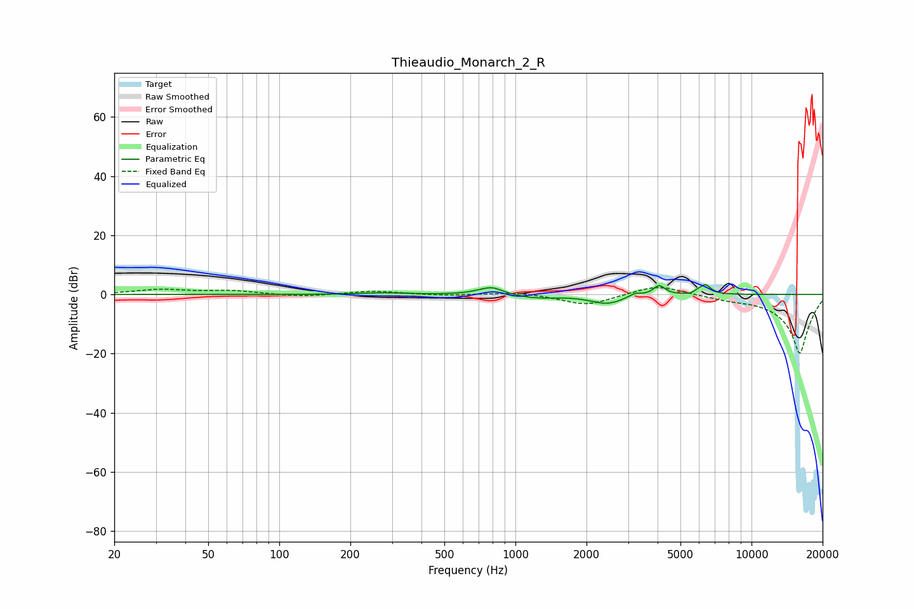

# Thieaudio_Monarch_2_R
See [usage instructions](https://github.com/jaakkopasanen/AutoEq#usage) for more options and info.

### Parametric EQs
Apply preamp of -3.4 dB when using parametric equalizer.

|   # | Type    |   Fc (Hz) |    Q |   Gain (dB) |
|-----|---------|-----------|------|-------------|
|   1 | Peaking |       276 | 1.69 |         0.6 |
|   2 | Peaking |       717 | 2.51 |         0.6 |
|   3 | Peaking |       798 | 3.18 |         2.2 |
|   4 | Peaking |      1224 | 1.62 |        -1.2 |
|   5 | Peaking |      2447 | 1.99 |        -3.1 |
|   6 | Peaking |      3209 | 5.4  |         1.3 |
|   7 | Peaking |      4063 | 5.73 |         3.3 |
|   8 | Peaking |      5663 | 5.97 |        -1.7 |
|   9 | Peaking |      5775 | 5.96 |         2   |
|  10 | Peaking |      6383 | 6    |         3.1 |

### Fixed Band EQs
When using fixed band (also called graphic) equalizer, apply preamp of **-2.4 dB** (if available) and set gains manually with these parameters.

|   # | Type    |   Fc (Hz) |    Q |   Gain (dB) |
|-----|---------|-----------|------|-------------|
|   1 | Peaking |        31 | 1.41 |         1.6 |
|   2 | Peaking |        62 | 1.41 |         1.2 |
|   3 | Peaking |       125 | 1.41 |        -0.8 |
|   4 | Peaking |       250 | 1.41 |         1.2 |
|   5 | Peaking |       500 | 1.41 |        -0.4 |
|   6 | Peaking |      1000 | 1.41 |         0.9 |
|   7 | Peaking |      2000 | 1.41 |        -3.7 |
|   8 | Peaking |      4000 | 1.41 |         3.5 |
|   9 | Peaking |      8000 | 1.41 |        -1   |
|  10 | Peaking |     16000 | 1.41 |       -20   |

### Graphs

