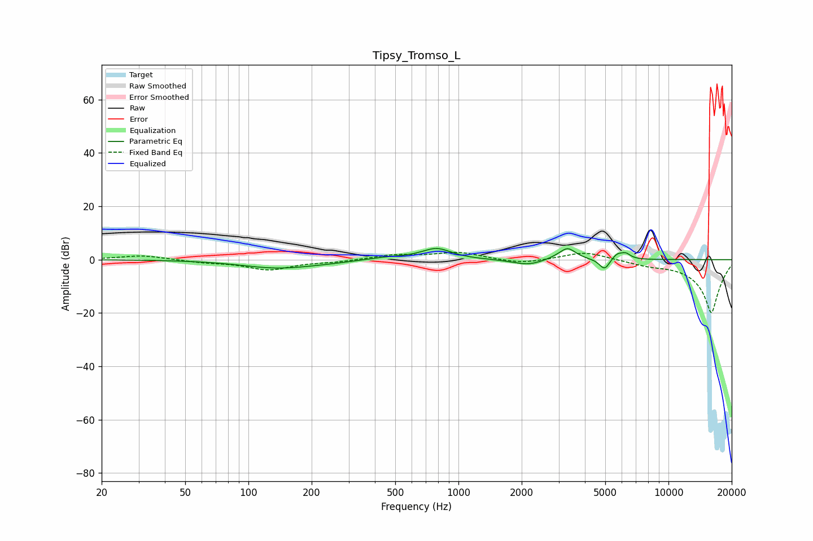

# Tipsy_Tromso_L
See [usage instructions](https://github.com/jaakkopasanen/AutoEq#usage) for more options and info.

### Parametric EQs
Apply preamp of -4.3 dB when using parametric equalizer.

|   # | Type    |   Fc (Hz) |    Q |   Gain (dB) |
|-----|---------|-----------|------|-------------|
|   1 | Peaking |       137 | 0.82 |        -3.1 |
|   2 | Peaking |       237 | 1.09 |        -0.5 |
|   3 | Peaking |       458 | 1.4  |         1   |
|   4 | Peaking |       786 | 1.99 |         4.1 |
|   5 | Peaking |      2147 | 1.91 |        -2.2 |
|   6 | Peaking |      2952 | 2.56 |         0.6 |
|   7 | Peaking |      3313 | 3.68 |         4.2 |
|   8 | Peaking |      4962 | 5.71 |        -4.2 |
|   9 | Peaking |      5690 | 5.42 |         2.2 |
|  10 | Peaking |      6257 | 6    |         2   |

### Fixed Band EQs
When using fixed band (also called graphic) equalizer, apply preamp of **-2.8 dB** (if available) and set gains manually with these parameters.

|   # | Type    |   Fc (Hz) |    Q |   Gain (dB) |
|-----|---------|-----------|------|-------------|
|   1 | Peaking |        31 | 1.41 |         1.6 |
|   2 | Peaking |        62 | 1.41 |        -0.9 |
|   3 | Peaking |       125 | 1.41 |        -3.7 |
|   4 | Peaking |       250 | 1.41 |        -0.7 |
|   5 | Peaking |       500 | 1.41 |         1.7 |
|   6 | Peaking |      1000 | 1.41 |         2.7 |
|   7 | Peaking |      2000 | 1.41 |        -1.7 |
|   8 | Peaking |      4000 | 1.41 |         3.1 |
|   9 | Peaking |      8000 | 1.41 |        -1.4 |
|  10 | Peaking |     16000 | 1.41 |       -20   |

### Graphs

