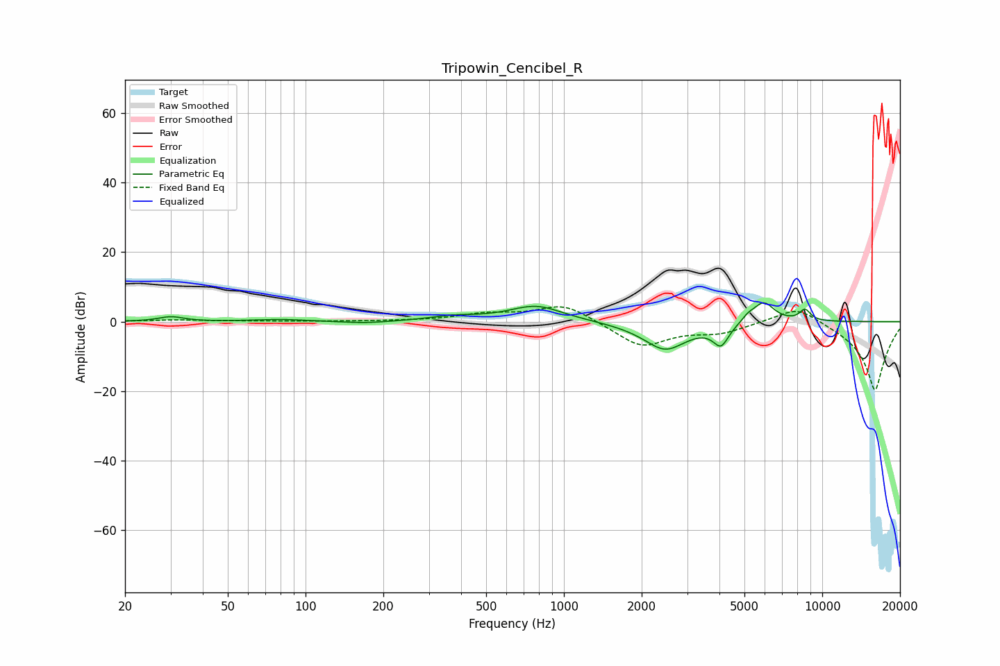

# Tripowin_Cencibel_R
See [usage instructions](https://github.com/jaakkopasanen/AutoEq#usage) for more options and info.

### Parametric EQs
Apply preamp of -5.5 dB when using parametric equalizer.

|   # | Type    |   Fc (Hz) |    Q |   Gain (dB) |
|-----|---------|-----------|------|-------------|
|   1 | Peaking |        30 | 3.03 |         1.4 |
|   2 | Peaking |        79 | 1.48 |         0.6 |
|   3 | Peaking |       171 | 1.61 |        -0.6 |
|   4 | Peaking |       374 | 1.57 |         1.2 |
|   5 | Peaking |       781 | 1.34 |         4.6 |
|   6 | Peaking |      2466 | 1.62 |        -8.1 |
|   7 | Peaking |      4055 | 4.6  |        -5.9 |
|   8 | Peaking |      5166 | 5.51 |         1.4 |
|   9 | Peaking |      5929 | 3.27 |         6   |
|  10 | Peaking |      8576 | 6    |         3.2 |

### Fixed Band EQs
When using fixed band (also called graphic) equalizer, apply preamp of **-4.3 dB** (if available) and set gains manually with these parameters.

|   # | Type    |   Fc (Hz) |    Q |   Gain (dB) |
|-----|---------|-----------|------|-------------|
|   1 | Peaking |        31 | 1.41 |         0.5 |
|   2 | Peaking |        62 | 1.41 |         0.1 |
|   3 | Peaking |       125 | 1.41 |         0   |
|   4 | Peaking |       250 | 1.41 |         0.1 |
|   5 | Peaking |       500 | 1.41 |         2   |
|   6 | Peaking |      1000 | 1.41 |         5.2 |
|   7 | Peaking |      2000 | 1.41 |        -7.3 |
|   8 | Peaking |      4000 | 1.41 |        -2.8 |
|   9 | Peaking |      8000 | 1.41 |         5.2 |
|  10 | Peaking |     16000 | 1.41 |       -20   |

### Graphs

