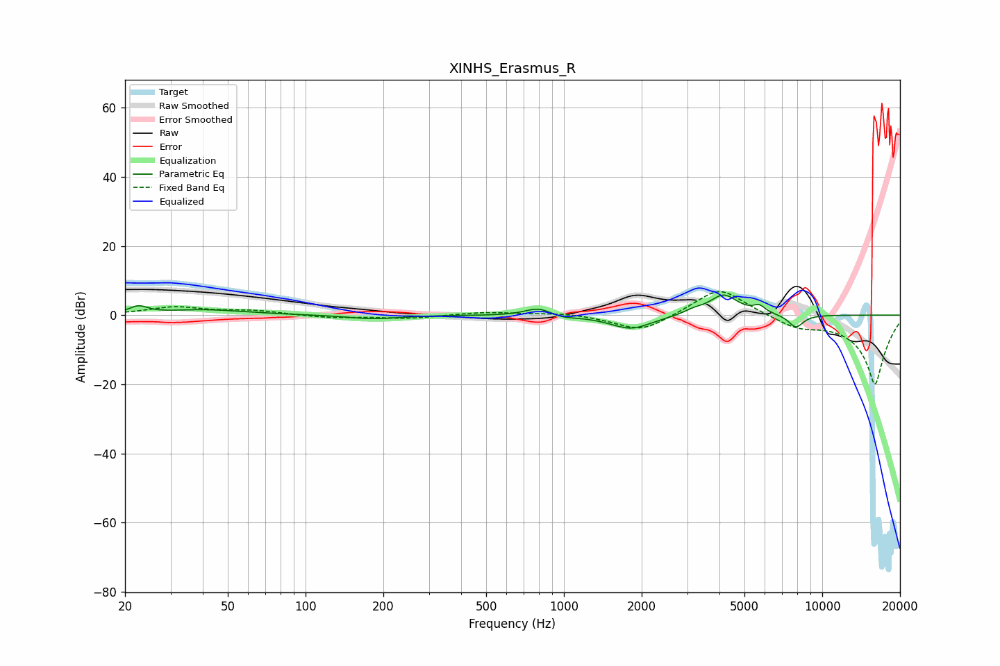

# XINHS_Erasmus_R
See [usage instructions](https://github.com/jaakkopasanen/AutoEq#usage) for more options and info.

### Parametric EQs
Apply preamp of -5.9 dB when using parametric equalizer.

|   # | Type    |   Fc (Hz) |    Q |   Gain (dB) |
|-----|---------|-----------|------|-------------|
|   1 | Peaking |        23 | 4.2  |         2.1 |
|   2 | Peaking |        41 | 0.91 |         1.5 |
|   3 | Peaking |       183 | 1.48 |        -1.1 |
|   4 | Peaking |       796 | 2.74 |         2.3 |
|   5 | Peaking |       993 | 2.92 |        -0.7 |
|   6 | Peaking |      1820 | 1.74 |        -4   |
|   7 | Peaking |      3172 | 3.85 |         1   |
|   8 | Peaking |      4150 | 2.51 |         6   |
|   9 | Peaking |      5707 | 5.99 |         2   |
|  10 | Peaking |      7909 | 4.48 |        -3.8 |

### Fixed Band EQs
When using fixed band (also called graphic) equalizer, apply preamp of **-6.9 dB** (if available) and set gains manually with these parameters.

|   # | Type    |   Fc (Hz) |    Q |   Gain (dB) |
|-----|---------|-----------|------|-------------|
|   1 | Peaking |        31 | 1.41 |         2.3 |
|   2 | Peaking |        62 | 1.41 |         1.2 |
|   3 | Peaking |       125 | 1.41 |        -0.8 |
|   4 | Peaking |       250 | 1.41 |        -0.9 |
|   5 | Peaking |       500 | 1.41 |         0.9 |
|   6 | Peaking |      1000 | 1.41 |         0.7 |
|   7 | Peaking |      2000 | 1.41 |        -5.1 |
|   8 | Peaking |      4000 | 1.41 |         8.5 |
|   9 | Peaking |      8000 | 1.41 |        -3.1 |
|  10 | Peaking |     16000 | 1.41 |       -20   |

### Graphs

