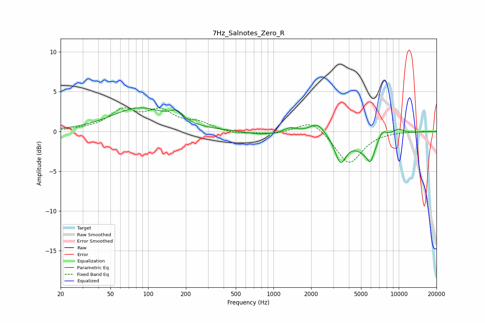

# 7Hz_Salnotes_Zero_R
See [usage instructions](https://github.com/jaakkopasanen/AutoEq#usage) for more options and info.

### Parametric EQs
Apply preamp of -3.1 dB when using parametric equalizer.

|   # | Type    |   Fc (Hz) |    Q |   Gain (dB) |
|-----|---------|-----------|------|-------------|
|   1 | Peaking |        85 | 0.64 |         2.9 |
|   2 | Peaking |       169 | 2.84 |         1.1 |
|   3 | Peaking |       830 | 1.07 |        -0.4 |
|   4 | Peaking |      1357 | 2.88 |         0.6 |
|   5 | Peaking |      2243 | 2.31 |         1.4 |
|   6 | Peaking |      3425 | 3.11 |        -3.3 |
|   7 | Peaking |      5930 | 5.99 |        -1.1 |
|   8 | Peaking |      6109 | 1.28 |        -3.4 |
|   9 | Peaking |      7291 | 2.71 |         2.4 |
|  10 | Peaking |      9831 | 2.29 |         0.8 |

### Fixed Band EQs
When using fixed band (also called graphic) equalizer, apply preamp of **-3.1 dB** (if available) and set gains manually with these parameters.

|   # | Type    |   Fc (Hz) |    Q |   Gain (dB) |
|-----|---------|-----------|------|-------------|
|   1 | Peaking |        31 | 1.41 |         0.2 |
|   2 | Peaking |        62 | 1.41 |         2.5 |
|   3 | Peaking |       125 | 1.41 |         2.3 |
|   4 | Peaking |       250 | 1.41 |         1   |
|   5 | Peaking |       500 | 1.41 |        -0.4 |
|   6 | Peaking |      1000 | 1.41 |        -0.3 |
|   7 | Peaking |      2000 | 1.41 |         1.6 |
|   8 | Peaking |      4000 | 1.41 |        -4.1 |
|   9 | Peaking |      8000 | 1.41 |         0   |
|  10 | Peaking |     16000 | 1.41 |         0   |

### Graphs

