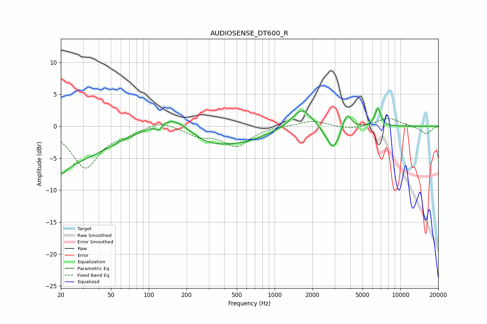

# AUDIOSENSE_DT600_R
See [usage instructions](https://github.com/jaakkopasanen/AutoEq#usage) for more options and info.

### Parametric EQs
Apply preamp of -2.9 dB when using parametric equalizer.

|   # | Type    |   Fc (Hz) |    Q |   Gain (dB) |
|-----|---------|-----------|------|-------------|
|   1 | Peaking |        20 | 0.43 |        -5.9 |
|   2 | Peaking |        20 | 3.53 |        -1.5 |
|   3 | Peaking |       120 | 5.56 |        -1   |
|   4 | Peaking |       156 | 1.01 |         2.9 |
|   5 | Peaking |       292 | 0.72 |        -2.6 |
|   6 | Peaking |       601 | 0.75 |        -1.5 |
|   7 | Peaking |      1654 | 1.78 |         3.2 |
|   8 | Peaking |      2923 | 2.59 |        -3.9 |
|   9 | Peaking |      3750 | 4.25 |         2.7 |
|  10 | Peaking |      6615 | 6    |         2.8 |

### Fixed Band EQs
When using fixed band (also called graphic) equalizer, apply preamp of **-1.3 dB** (if available) and set gains manually with these parameters.

|   # | Type    |   Fc (Hz) |    Q |   Gain (dB) |
|-----|---------|-----------|------|-------------|
|   1 | Peaking |        31 | 1.41 |        -6.4 |
|   2 | Peaking |        62 | 1.41 |        -0.9 |
|   3 | Peaking |       125 | 1.41 |         1   |
|   4 | Peaking |       250 | 1.41 |        -1.3 |
|   5 | Peaking |       500 | 1.41 |        -3   |
|   6 | Peaking |      1000 | 1.41 |         0.1 |
|   7 | Peaking |      2000 | 1.41 |         0.9 |
|   8 | Peaking |      4000 | 1.41 |        -0.5 |
|   9 | Peaking |      8000 | 1.41 |         1.3 |
|  10 | Peaking |     16000 | 1.41 |        -1.2 |

### Graphs

