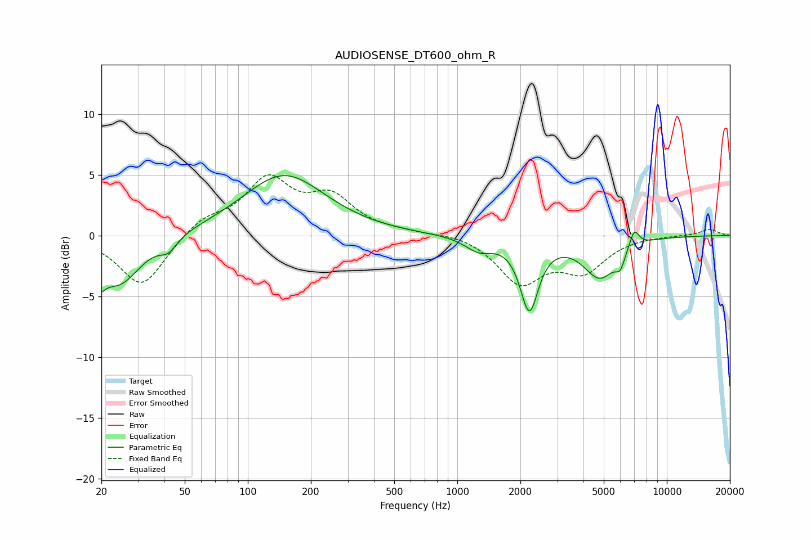

# AUDIOSENSE_DT600_ohm_R
See [usage instructions](https://github.com/jaakkopasanen/AutoEq#usage) for more options and info.

### Parametric EQs
Apply preamp of -5.0 dB when using parametric equalizer.

|   # | Type    |   Fc (Hz) |    Q |   Gain (dB) |
|-----|---------|-----------|------|-------------|
|   1 | Peaking |        20 | 5.46 |        -4   |
|   2 | Peaking |        20 | 6    |         2.3 |
|   3 | Peaking |        24 | 1.37 |        -3.9 |
|   4 | Peaking |        42 | 3.53 |        -1   |
|   5 | Peaking |       149 | 0.72 |         5   |
|   6 | Peaking |      1268 | 2.14 |        -1.1 |
|   7 | Peaking |      2206 | 3.28 |        -5.8 |
|   8 | Peaking |      4791 | 1.76 |        -3.3 |
|   9 | Peaking |      5990 | 6    |        -1.2 |
|  10 | Peaking |      6990 | 5.89 |         1.5 |

### Fixed Band EQs
When using fixed band (also called graphic) equalizer, apply preamp of **-5.1 dB** (if available) and set gains manually with these parameters.

|   # | Type    |   Fc (Hz) |    Q |   Gain (dB) |
|-----|---------|-----------|------|-------------|
|   1 | Peaking |        31 | 1.41 |        -4.3 |
|   2 | Peaking |        62 | 1.41 |         1.3 |
|   3 | Peaking |       125 | 1.41 |         4.4 |
|   4 | Peaking |       250 | 1.41 |         2.8 |
|   5 | Peaking |       500 | 1.41 |         0.2 |
|   6 | Peaking |      1000 | 1.41 |         0.3 |
|   7 | Peaking |      2000 | 1.41 |        -3.7 |
|   8 | Peaking |      4000 | 1.41 |        -2.7 |
|   9 | Peaking |      8000 | 1.41 |         0   |
|  10 | Peaking |     16000 | 1.41 |         0.5 |

### Graphs

