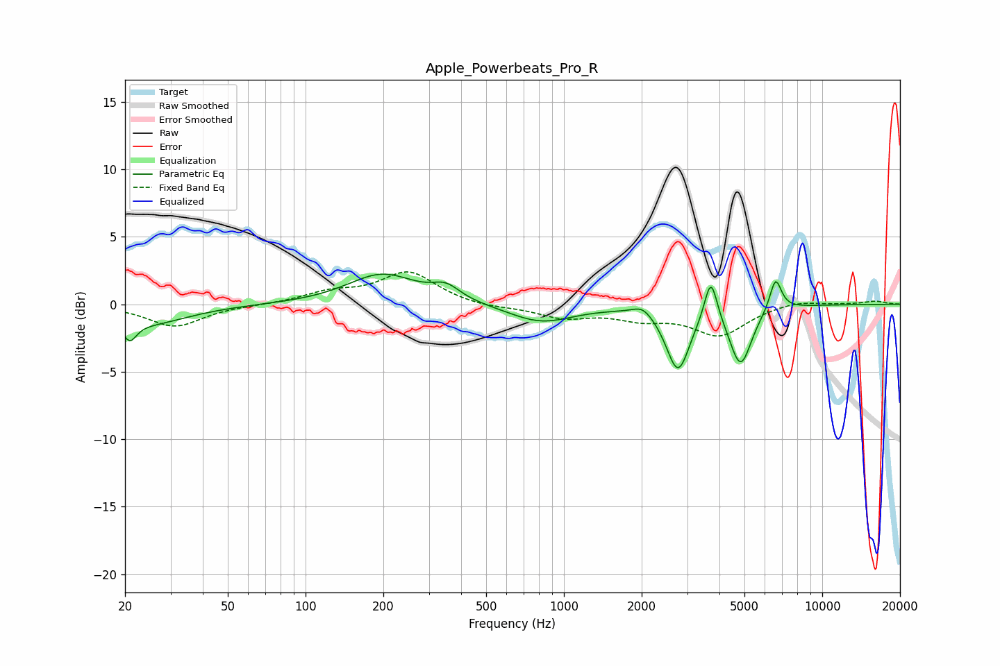

# Apple_Powerbeats_Pro_R
See [usage instructions](https://github.com/jaakkopasanen/AutoEq#usage) for more options and info.

### Parametric EQs
Apply preamp of -2.3 dB when using parametric equalizer.

|   # | Type    |   Fc (Hz) |    Q |   Gain (dB) |
|-----|---------|-----------|------|-------------|
|   1 | Peaking |        21 | 5.37 |        -1.4 |
|   2 | Peaking |        25 | 0.91 |        -1.4 |
|   3 | Peaking |       198 | 1.07 |         2.2 |
|   4 | Peaking |       350 | 2.64 |         1   |
|   5 | Peaking |       815 | 1.13 |        -1.3 |
|   6 | Peaking |      2021 | 3.68 |         0.7 |
|   7 | Peaking |      2765 | 3.13 |        -4.7 |
|   8 | Peaking |      3706 | 5.72 |         3.3 |
|   9 | Peaking |      4829 | 3.28 |        -4.4 |
|  10 | Peaking |      6597 | 6    |         2.4 |

### Fixed Band EQs
When using fixed band (also called graphic) equalizer, apply preamp of **-2.5 dB** (if available) and set gains manually with these parameters.

|   # | Type    |   Fc (Hz) |    Q |   Gain (dB) |
|-----|---------|-----------|------|-------------|
|   1 | Peaking |        31 | 1.41 |        -1.6 |
|   2 | Peaking |        62 | 1.41 |        -0   |
|   3 | Peaking |       125 | 1.41 |         0.8 |
|   4 | Peaking |       250 | 1.41 |         2.4 |
|   5 | Peaking |       500 | 1.41 |        -0.3 |
|   6 | Peaking |      1000 | 1.41 |        -0.9 |
|   7 | Peaking |      2000 | 1.41 |        -0.9 |
|   8 | Peaking |      4000 | 1.41 |        -2.2 |
|   9 | Peaking |      8000 | 1.41 |         0.3 |
|  10 | Peaking |     16000 | 1.41 |         0.2 |

### Graphs

