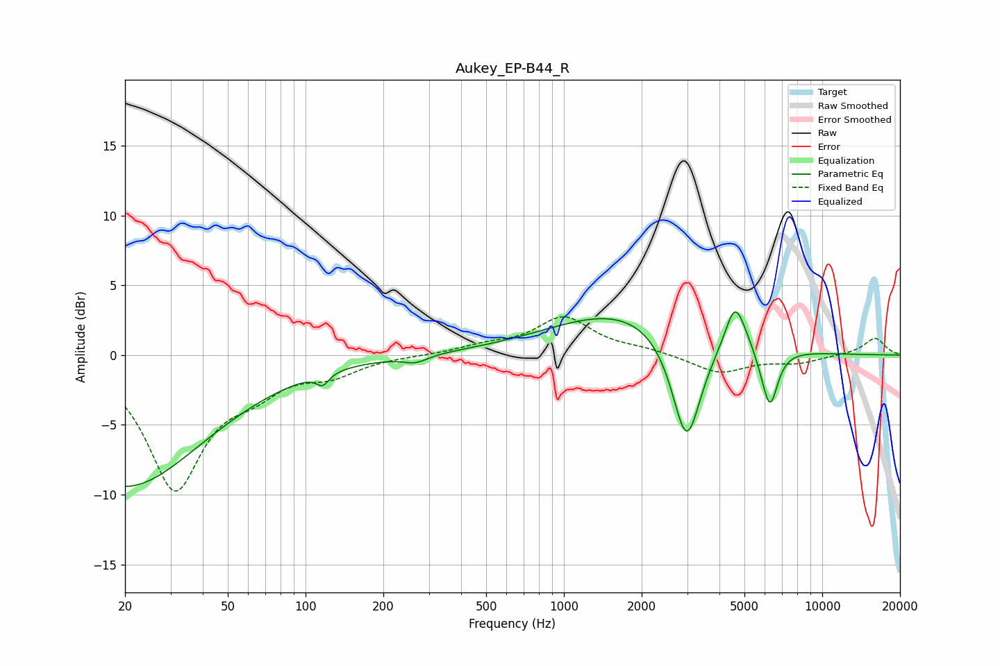

# Aukey_EP-B44_R
See [usage instructions](https://github.com/jaakkopasanen/AutoEq#usage) for more options and info.

### Parametric EQs
Apply preamp of -3.2 dB when using parametric equalizer.

|   # | Type    |   Fc (Hz) |    Q |   Gain (dB) |
|-----|---------|-----------|------|-------------|
|   1 | Peaking |        20 | 0.45 |        -9.4 |
|   2 | Peaking |       117 | 5.91 |        -0.8 |
|   3 | Peaking |       267 | 2.94 |        -0.5 |
|   4 | Peaking |      1756 | 0.49 |         3.3 |
|   5 | Peaking |      2985 | 2.45 |        -8.2 |
|   6 | Peaking |      4594 | 3.73 |         3.2 |
|   7 | Peaking |      5323 | 2.14 |         1.1 |
|   8 | Peaking |      5443 | 3.09 |         0.6 |
|   9 | Peaking |      5645 | 2.71 |        -1.8 |
|  10 | Peaking |      6280 | 4.55 |        -3.8 |

### Fixed Band EQs
When using fixed band (also called graphic) equalizer, apply preamp of **-2.8 dB** (if available) and set gains manually with these parameters.

|   # | Type    |   Fc (Hz) |    Q |   Gain (dB) |
|-----|---------|-----------|------|-------------|
|   1 | Peaking |        31 | 1.41 |        -9.4 |
|   2 | Peaking |        62 | 1.41 |        -1.8 |
|   3 | Peaking |       125 | 1.41 |        -1.2 |
|   4 | Peaking |       250 | 1.41 |        -0   |
|   5 | Peaking |       500 | 1.41 |         0.6 |
|   6 | Peaking |      1000 | 1.41 |         2.6 |
|   7 | Peaking |      2000 | 1.41 |         0.3 |
|   8 | Peaking |      4000 | 1.41 |        -1.3 |
|   9 | Peaking |      8000 | 1.41 |        -0.5 |
|  10 | Peaking |     16000 | 1.41 |         1.2 |

### Graphs

