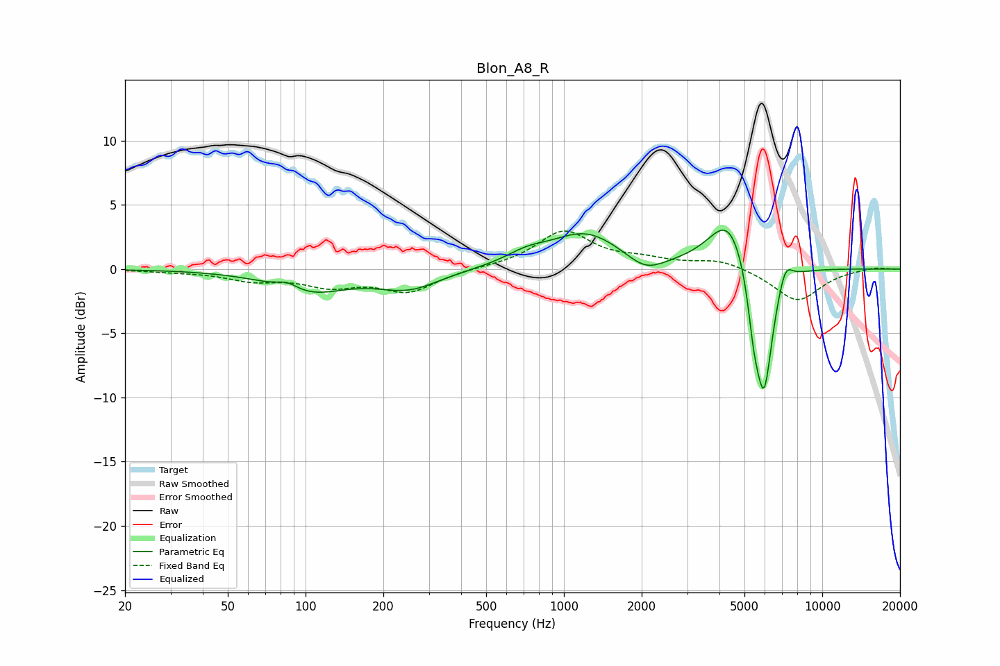

# Blon_A8_R
See [usage instructions](https://github.com/jaakkopasanen/AutoEq#usage) for more options and info.

### Parametric EQs
Apply preamp of -3.1 dB when using parametric equalizer.

|   # | Type    |   Fc (Hz) |    Q |   Gain (dB) |
|-----|---------|-----------|------|-------------|
|   1 | Peaking |        85 | 3.36 |         0.6 |
|   2 | Peaking |       103 | 0.98 |        -1.7 |
|   3 | Peaking |       251 | 1.17 |        -1.4 |
|   4 | Peaking |       716 | 1.73 |         0.8 |
|   5 | Peaking |      1215 | 1.01 |         2.8 |
|   6 | Peaking |      2069 | 1.96 |        -1.2 |
|   7 | Peaking |      4371 | 1.74 |         4.3 |
|   8 | Peaking |      5436 | 5.9  |        -3.2 |
|   9 | Peaking |      5953 | 3.95 |       -10.1 |
|  10 | Peaking |      7201 | 5.09 |         1.6 |

### Fixed Band EQs
When using fixed band (also called graphic) equalizer, apply preamp of **-3.1 dB** (if available) and set gains manually with these parameters.

|   # | Type    |   Fc (Hz) |    Q |   Gain (dB) |
|-----|---------|-----------|------|-------------|
|   1 | Peaking |        31 | 1.41 |        -0.1 |
|   2 | Peaking |        62 | 1.41 |        -0.8 |
|   3 | Peaking |       125 | 1.41 |        -1.2 |
|   4 | Peaking |       250 | 1.41 |        -1.7 |
|   5 | Peaking |       500 | 1.41 |         0.1 |
|   6 | Peaking |      1000 | 1.41 |         2.9 |
|   7 | Peaking |      2000 | 1.41 |         0.6 |
|   8 | Peaking |      4000 | 1.41 |         0.7 |
|   9 | Peaking |      8000 | 1.41 |        -2.5 |
|  10 | Peaking |     16000 | 1.41 |         0.2 |

### Graphs

