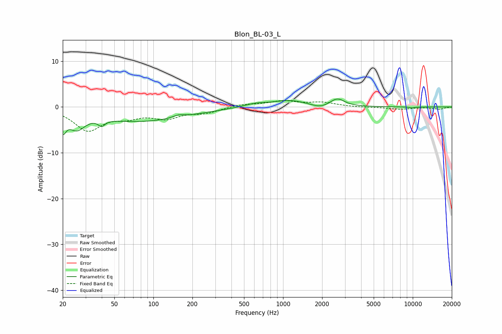

# Blon_BL-03_L
See [usage instructions](https://github.com/jaakkopasanen/AutoEq#usage) for more options and info.

### Parametric EQs
Apply preamp of -1.8 dB when using parametric equalizer.

|   # | Type    |   Fc (Hz) |    Q |   Gain (dB) |
|-----|---------|-----------|------|-------------|
|   1 | Peaking |        20 | 5.75 |        -3.5 |
|   2 | Peaking |        26 | 2.3  |        -3.4 |
|   3 | Peaking |        40 | 5.72 |        -1.3 |
|   4 | Peaking |        80 | 0.39 |        -3.1 |
|   5 | Peaking |       156 | 3.23 |         0.6 |
|   6 | Peaking |       614 | 1.59 |         0.7 |
|   7 | Peaking |      1122 | 1.1  |         1.4 |
|   8 | Peaking |      1921 | 2.44 |        -0.7 |
|   9 | Peaking |      2626 | 2.65 |         1.7 |
|  10 | Peaking |      9850 | 5.16 |        -0.2 |

### Fixed Band EQs
When using fixed band (also called graphic) equalizer, apply preamp of **-1.5 dB** (if available) and set gains manually with these parameters.

|   # | Type    |   Fc (Hz) |    Q |   Gain (dB) |
|-----|---------|-----------|------|-------------|
|   1 | Peaking |        31 | 1.41 |        -4.9 |
|   2 | Peaking |        62 | 1.41 |        -1.7 |
|   3 | Peaking |       125 | 1.41 |        -2.2 |
|   4 | Peaking |       250 | 1.41 |        -1.2 |
|   5 | Peaking |       500 | 1.41 |         0.6 |
|   6 | Peaking |      1000 | 1.41 |         1.2 |
|   7 | Peaking |      2000 | 1.41 |         0.9 |
|   8 | Peaking |      4000 | 1.41 |        -0.1 |
|   9 | Peaking |      8000 | 1.41 |        -0.5 |
|  10 | Peaking |     16000 | 1.41 |        -0.5 |

### Graphs

