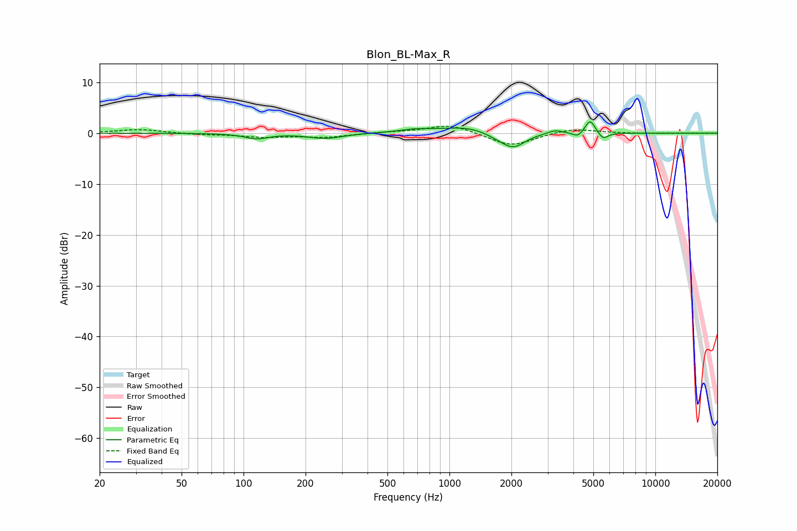

# Blon_BL-Max_R
See [usage instructions](https://github.com/jaakkopasanen/AutoEq#usage) for more options and info.

### Parametric EQs
Apply preamp of -2.3 dB when using parametric equalizer.

|   # | Type    |   Fc (Hz) |    Q |   Gain (dB) |
|-----|---------|-----------|------|-------------|
|   1 | Peaking |       116 | 2.52 |        -1   |
|   2 | Peaking |       251 | 1.71 |        -1   |
|   3 | Peaking |       676 | 1.94 |         0.5 |
|   4 | Peaking |      1228 | 1.09 |         1.4 |
|   5 | Peaking |      1746 | 2.08 |        -1   |
|   6 | Peaking |      2054 | 2.52 |        -2.6 |
|   7 | Peaking |      3255 | 3.93 |         0.7 |
|   8 | Peaking |      4208 | 6    |        -0.9 |
|   9 | Peaking |      4823 | 5.95 |         2.8 |
|  10 | Peaking |      5580 | 6    |        -1.4 |

### Fixed Band EQs
When using fixed band (also called graphic) equalizer, apply preamp of **-1.4 dB** (if available) and set gains manually with these parameters.

|   # | Type    |   Fc (Hz) |    Q |   Gain (dB) |
|-----|---------|-----------|------|-------------|
|   1 | Peaking |        31 | 1.41 |         0.8 |
|   2 | Peaking |        62 | 1.41 |        -0.3 |
|   3 | Peaking |       125 | 1.41 |        -0.7 |
|   4 | Peaking |       250 | 1.41 |        -0.8 |
|   5 | Peaking |       500 | 1.41 |         0.2 |
|   6 | Peaking |      1000 | 1.41 |         1.8 |
|   7 | Peaking |      2000 | 1.41 |        -2.6 |
|   8 | Peaking |      4000 | 1.41 |         1   |
|   9 | Peaking |      8000 | 1.41 |        -0.1 |
|  10 | Peaking |     16000 | 1.41 |        -0   |

### Graphs

