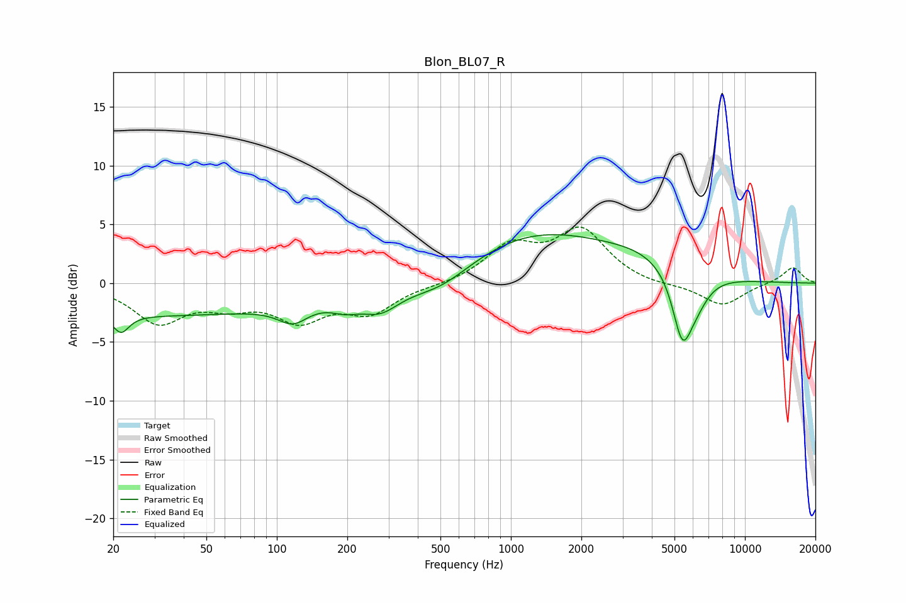

# Blon_BL07_R
See [usage instructions](https://github.com/jaakkopasanen/AutoEq#usage) for more options and info.

### Parametric EQs
Apply preamp of -4.2 dB when using parametric equalizer.

|   # | Type    |   Fc (Hz) |    Q |   Gain (dB) |
|-----|---------|-----------|------|-------------|
|   1 | Peaking |        22 | 4.3  |        -1.5 |
|   2 | Peaking |        28 | 0.18 |        -2.7 |
|   3 | Peaking |       117 | 2.22 |        -1.5 |
|   4 | Peaking |       196 | 2.36 |        -0.8 |
|   5 | Peaking |       276 | 1.68 |        -1.9 |
|   6 | Peaking |       500 | 0.99 |        -1.9 |
|   7 | Peaking |      1256 | 0.43 |         4.2 |
|   8 | Peaking |      3811 | 0.74 |         1.4 |
|   9 | Peaking |      5396 | 3.27 |        -5.5 |
|  10 | Peaking |      6171 | 2.39 |        -1.9 |

### Fixed Band EQs
When using fixed band (also called graphic) equalizer, apply preamp of **-4.9 dB** (if available) and set gains manually with these parameters.

|   # | Type    |   Fc (Hz) |    Q |   Gain (dB) |
|-----|---------|-----------|------|-------------|
|   1 | Peaking |        31 | 1.41 |        -3.2 |
|   2 | Peaking |        62 | 1.41 |        -1.5 |
|   3 | Peaking |       125 | 1.41 |        -2.8 |
|   4 | Peaking |       250 | 1.41 |        -2.3 |
|   5 | Peaking |       500 | 1.41 |        -0.2 |
|   6 | Peaking |      1000 | 1.41 |         3   |
|   7 | Peaking |      2000 | 1.41 |         4.3 |
|   8 | Peaking |      4000 | 1.41 |        -0.3 |
|   9 | Peaking |      8000 | 1.41 |        -1.9 |
|  10 | Peaking |     16000 | 1.41 |         1.4 |

### Graphs

