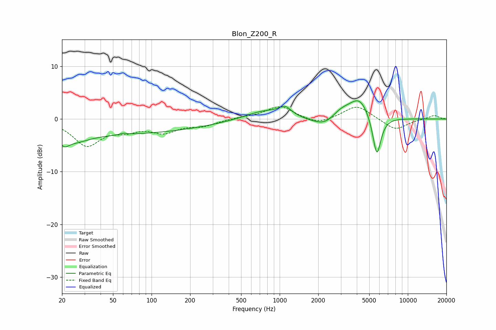

# Blon_Z200_R
See [usage instructions](https://github.com/jaakkopasanen/AutoEq#usage) for more options and info.

### Parametric EQs
Apply preamp of -3.6 dB when using parametric equalizer.

|   # | Type    |   Fc (Hz) |    Q |   Gain (dB) |
|-----|---------|-----------|------|-------------|
|   1 | Peaking |        21 | 4.39 |        -1.3 |
|   2 | Peaking |        24 | 1.16 |        -1.9 |
|   3 | Peaking |        54 | 0.19 |        -2.7 |
|   4 | Peaking |        60 | 5.96 |         0.3 |
|   5 | Peaking |       751 | 0.99 |         1.7 |
|   6 | Peaking |      1101 | 2.87 |         1.7 |
|   7 | Peaking |      2316 | 1.39 |        -2.3 |
|   8 | Peaking |      2954 | 1.64 |         2.1 |
|   9 | Peaking |      4209 | 1.77 |         3.9 |
|  10 | Peaking |      5727 | 4.15 |        -8   |

### Fixed Band EQs
When using fixed band (also called graphic) equalizer, apply preamp of **-2.4 dB** (if available) and set gains manually with these parameters.

|   # | Type    |   Fc (Hz) |    Q |   Gain (dB) |
|-----|---------|-----------|------|-------------|
|   1 | Peaking |        31 | 1.41 |        -4.8 |
|   2 | Peaking |        62 | 1.41 |        -1.6 |
|   3 | Peaking |       125 | 1.41 |        -2.2 |
|   4 | Peaking |       250 | 1.41 |        -1.1 |
|   5 | Peaking |       500 | 1.41 |         0.2 |
|   6 | Peaking |      1000 | 1.41 |         2.5 |
|   7 | Peaking |      2000 | 1.41 |        -1.1 |
|   8 | Peaking |      4000 | 1.41 |         2.7 |
|   9 | Peaking |      8000 | 1.41 |        -2.1 |
|  10 | Peaking |     16000 | 1.41 |         0.7 |

### Graphs

