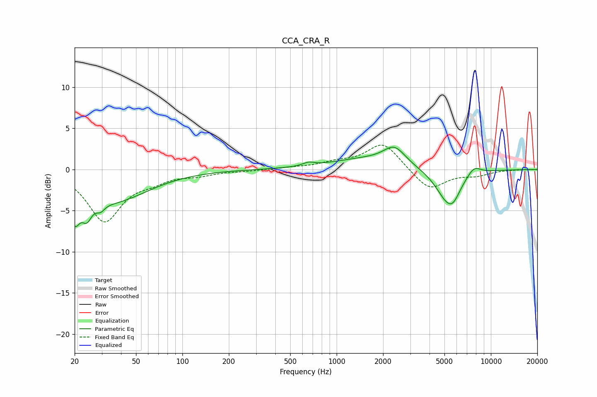

# CCA_CRA_R
See [usage instructions](https://github.com/jaakkopasanen/AutoEq#usage) for more options and info.

### Parametric EQs
Apply preamp of -2.8 dB when using parametric equalizer.

|   # | Type    |   Fc (Hz) |    Q |   Gain (dB) |
|-----|---------|-----------|------|-------------|
|   1 | Peaking |        20 | 4.41 |        -3.7 |
|   2 | Peaking |        24 | 4.36 |        -2.3 |
|   3 | Peaking |        29 | 5.26 |        -0.8 |
|   4 | Peaking |        35 | 0.62 |        -3.8 |
|   5 | Peaking |       658 | 3.89 |         0.4 |
|   6 | Peaking |      1534 | 0.63 |         1.2 |
|   7 | Peaking |      2372 | 2    |         2.1 |
|   8 | Peaking |      5289 | 1.77 |        -4   |
|   9 | Peaking |      5729 | 3.67 |        -0.8 |
|  10 | Peaking |      7761 | 2.96 |         1.1 |

### Fixed Band EQs
When using fixed band (also called graphic) equalizer, apply preamp of **-3.0 dB** (if available) and set gains manually with these parameters.

|   # | Type    |   Fc (Hz) |    Q |   Gain (dB) |
|-----|---------|-----------|------|-------------|
|   1 | Peaking |        31 | 1.41 |        -6.2 |
|   2 | Peaking |        62 | 1.41 |        -1   |
|   3 | Peaking |       125 | 1.41 |        -0.6 |
|   4 | Peaking |       250 | 1.41 |        -0.2 |
|   5 | Peaking |       500 | 1.41 |         0.2 |
|   6 | Peaking |      1000 | 1.41 |         0.7 |
|   7 | Peaking |      2000 | 1.41 |         3.3 |
|   8 | Peaking |      4000 | 1.41 |        -2.6 |
|   9 | Peaking |      8000 | 1.41 |        -0.6 |
|  10 | Peaking |     16000 | 1.41 |         0   |

### Graphs

