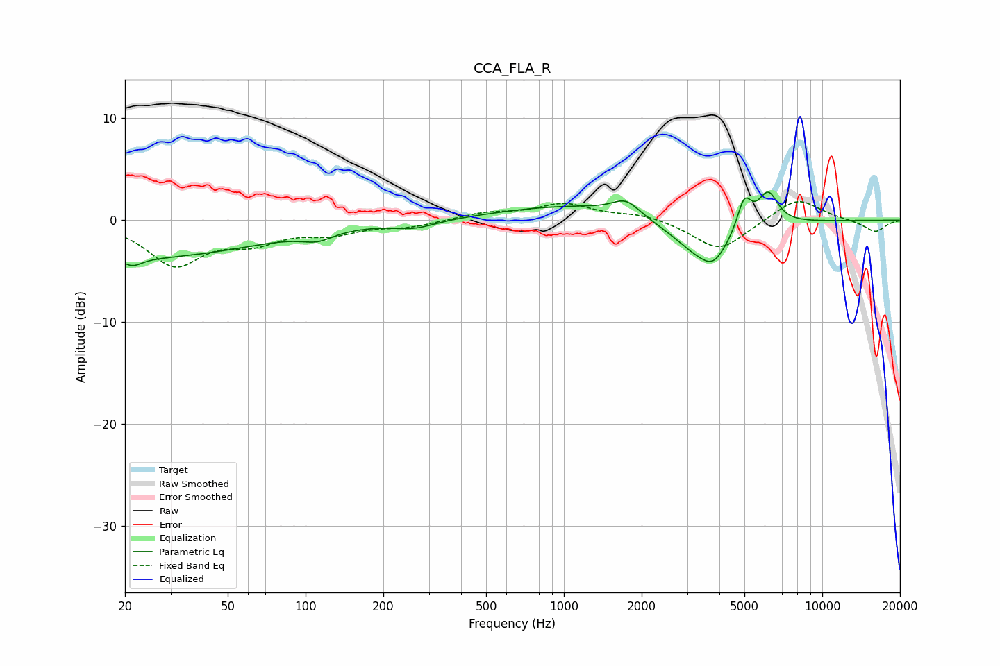

# CCA_FLA_R
See [usage instructions](https://github.com/jaakkopasanen/AutoEq#usage) for more options and info.

### Parametric EQs
Apply preamp of -2.9 dB when using parametric equalizer.

|   # | Type    |   Fc (Hz) |    Q |   Gain (dB) |
|-----|---------|-----------|------|-------------|
|   1 | Peaking |        21 | 4.02 |        -0.8 |
|   2 | Peaking |        21 | 0.28 |        -3.7 |
|   3 | Peaking |       111 | 2.35 |        -0.8 |
|   4 | Peaking |       264 | 1.69 |        -0.7 |
|   5 | Peaking |      1111 | 0.5  |         1.5 |
|   6 | Peaking |      1740 | 2.71 |         1.5 |
|   7 | Peaking |      3479 | 1.25 |        -3.9 |
|   8 | Peaking |      3805 | 3.31 |        -1.3 |
|   9 | Peaking |      4995 | 5    |         3.2 |
|  10 | Peaking |      6169 | 3.56 |         3.2 |

### Fixed Band EQs
When using fixed band (also called graphic) equalizer, apply preamp of **-1.9 dB** (if available) and set gains manually with these parameters.

|   # | Type    |   Fc (Hz) |    Q |   Gain (dB) |
|-----|---------|-----------|------|-------------|
|   1 | Peaking |        31 | 1.41 |        -4.2 |
|   2 | Peaking |        62 | 1.41 |        -1.8 |
|   3 | Peaking |       125 | 1.41 |        -1.1 |
|   4 | Peaking |       250 | 1.41 |        -0.6 |
|   5 | Peaking |       500 | 1.41 |         0.7 |
|   6 | Peaking |      1000 | 1.41 |         1.5 |
|   7 | Peaking |      2000 | 1.41 |         0.6 |
|   8 | Peaking |      4000 | 1.41 |        -3   |
|   9 | Peaking |      8000 | 1.41 |         2.3 |
|  10 | Peaking |     16000 | 1.41 |        -1.2 |

### Graphs

