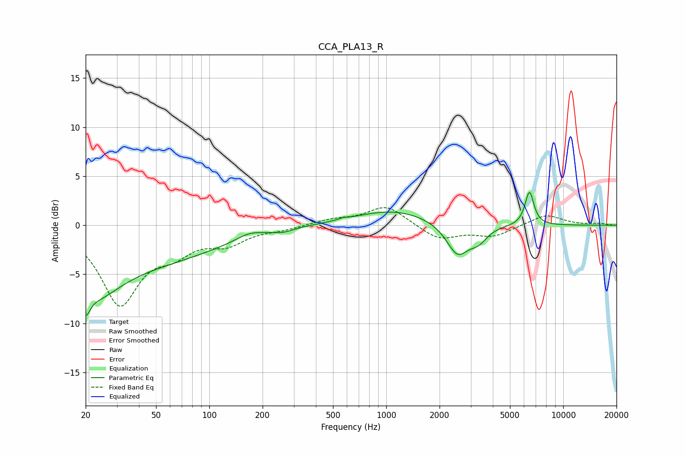

# CCA_PLA13_R
See [usage instructions](https://github.com/jaakkopasanen/AutoEq#usage) for more options and info.

### Parametric EQs
Apply preamp of -3.4 dB when using parametric equalizer.

|   # | Type    |   Fc (Hz) |    Q |   Gain (dB) |
|-----|---------|-----------|------|-------------|
|   1 | Peaking |        20 | 5.96 |        -2.2 |
|   2 | Peaking |        21 | 0.18 |        -4.3 |
|   3 | Peaking |        23 | 1.09 |        -2.9 |
|   4 | Peaking |       168 | 1.98 |         0.6 |
|   5 | Peaking |       263 | 2.93 |        -0.3 |
|   6 | Peaking |       572 | 6    |         0.1 |
|   7 | Peaking |      1098 | 0.64 |         1.6 |
|   8 | Peaking |      2529 | 2.23 |        -3.2 |
|   9 | Peaking |      3320 | 2.89 |        -1.3 |
|  10 | Peaking |      6444 | 5.51 |         3.5 |

### Fixed Band EQs
When using fixed band (also called graphic) equalizer, apply preamp of **-1.9 dB** (if available) and set gains manually with these parameters.

|   # | Type    |   Fc (Hz) |    Q |   Gain (dB) |
|-----|---------|-----------|------|-------------|
|   1 | Peaking |        31 | 1.41 |        -7.8 |
|   2 | Peaking |        62 | 1.41 |        -2.1 |
|   3 | Peaking |       125 | 1.41 |        -1.6 |
|   4 | Peaking |       250 | 1.41 |        -0.3 |
|   5 | Peaking |       500 | 1.41 |         0.5 |
|   6 | Peaking |      1000 | 1.41 |         2   |
|   7 | Peaking |      2000 | 1.41 |        -1.5 |
|   8 | Peaking |      4000 | 1.41 |        -1.1 |
|   9 | Peaking |      8000 | 1.41 |         1.1 |
|  10 | Peaking |     16000 | 1.41 |         0.2 |

### Graphs

