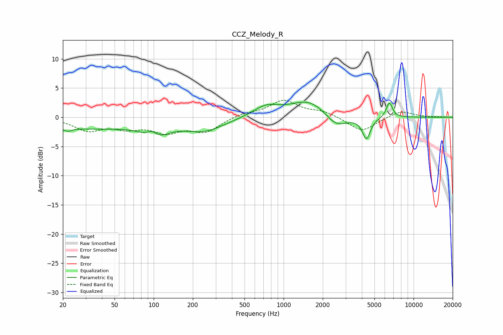

# CCZ_Melody_R
See [usage instructions](https://github.com/jaakkopasanen/AutoEq#usage) for more options and info.

### Parametric EQs
Apply preamp of -2.7 dB when using parametric equalizer.

|   # | Type    |   Fc (Hz) |    Q |   Gain (dB) |
|-----|---------|-----------|------|-------------|
|   1 | Peaking |        22 | 4.43 |        -0.6 |
|   2 | Peaking |        31 | 0.38 |        -1.8 |
|   3 | Peaking |        98 | 3.26 |         1.6 |
|   4 | Peaking |       102 | 1.56 |        -2.9 |
|   5 | Peaking |       246 | 0.93 |        -2.2 |
|   6 | Peaking |       730 | 1.42 |         1.8 |
|   7 | Peaking |      1578 | 0.99 |         3   |
|   8 | Peaking |      2536 | 1.61 |        -2.4 |
|   9 | Peaking |      4336 | 4.47 |        -3.7 |
|  10 | Peaking |      6509 | 5.78 |         2.6 |

### Fixed Band EQs
When using fixed band (also called graphic) equalizer, apply preamp of **-3.0 dB** (if available) and set gains manually with these parameters.

|   # | Type    |   Fc (Hz) |    Q |   Gain (dB) |
|-----|---------|-----------|------|-------------|
|   1 | Peaking |        31 | 1.41 |        -2.1 |
|   2 | Peaking |        62 | 1.41 |        -1.5 |
|   3 | Peaking |       125 | 1.41 |        -2.3 |
|   4 | Peaking |       250 | 1.41 |        -2.3 |
|   5 | Peaking |       500 | 1.41 |         0.6 |
|   6 | Peaking |      1000 | 1.41 |         2.8 |
|   7 | Peaking |      2000 | 1.41 |         0.9 |
|   8 | Peaking |      4000 | 1.41 |        -2.5 |
|   9 | Peaking |      8000 | 1.41 |         1.2 |
|  10 | Peaking |     16000 | 1.41 |         0   |

### Graphs

