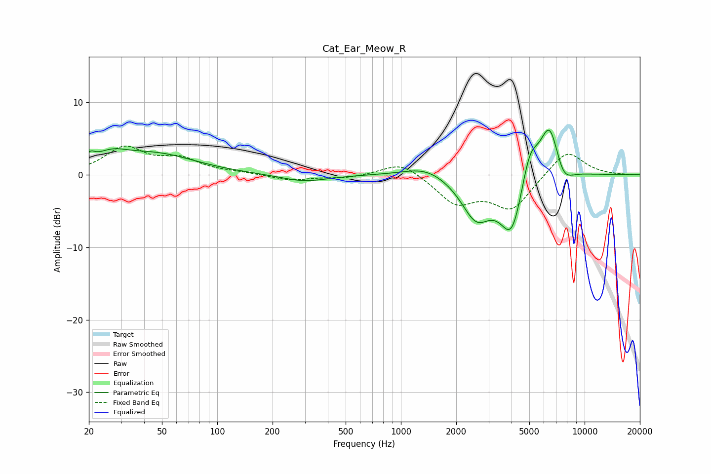

# Cat_Ear_Meow_R
See [usage instructions](https://github.com/jaakkopasanen/AutoEq#usage) for more options and info.

### Parametric EQs
Apply preamp of -6.3 dB when using parametric equalizer.

|   # | Type    |   Fc (Hz) |    Q |   Gain (dB) |
|-----|---------|-----------|------|-------------|
|   1 | Peaking |        20 | 5.95 |         1.1 |
|   2 | Peaking |        26 | 1.54 |         1.7 |
|   3 | Peaking |        46 | 0.65 |         2.7 |
|   4 | Peaking |       297 | 1.09 |        -1   |
|   5 | Peaking |      1369 | 1.18 |         1.4 |
|   6 | Peaking |      2565 | 1.72 |        -5.6 |
|   7 | Peaking |      4018 | 2.15 |        -8.3 |
|   8 | Peaking |      5022 | 2.9  |         4.9 |
|   9 | Peaking |      6455 | 2.49 |         7.7 |
|  10 | Peaking |      7633 | 2.64 |        -2.7 |

### Fixed Band EQs
When using fixed band (also called graphic) equalizer, apply preamp of **-4.0 dB** (if available) and set gains manually with these parameters.

|   # | Type    |   Fc (Hz) |    Q |   Gain (dB) |
|-----|---------|-----------|------|-------------|
|   1 | Peaking |        31 | 1.41 |         3.6 |
|   2 | Peaking |        62 | 1.41 |         1.9 |
|   3 | Peaking |       125 | 1.41 |         0.2 |
|   4 | Peaking |       250 | 1.41 |        -0.8 |
|   5 | Peaking |       500 | 1.41 |        -0.4 |
|   6 | Peaking |      1000 | 1.41 |         1.9 |
|   7 | Peaking |      2000 | 1.41 |        -3.8 |
|   8 | Peaking |      4000 | 1.41 |        -4.6 |
|   9 | Peaking |      8000 | 1.41 |         3.6 |
|  10 | Peaking |     16000 | 1.41 |        -0   |

### Graphs

