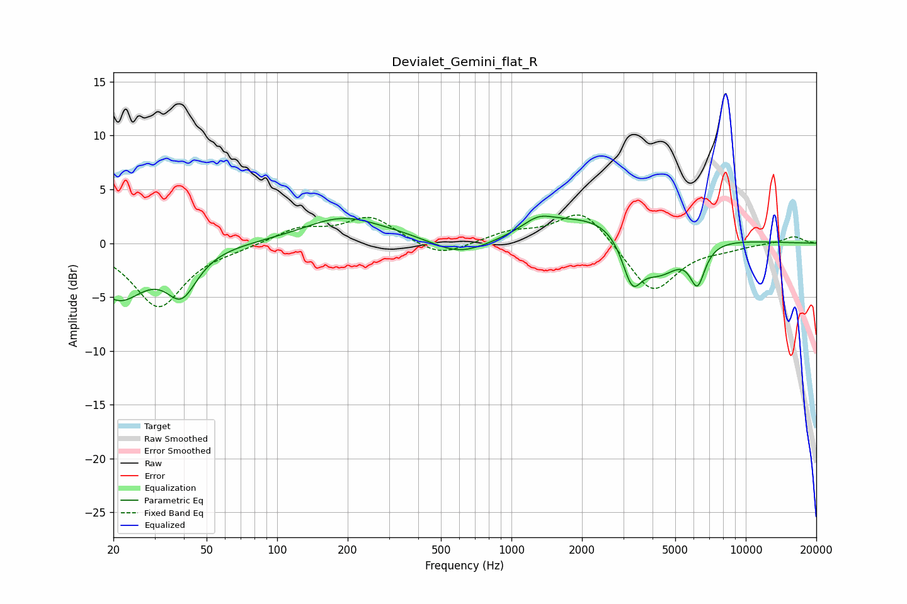

# Devialet_Gemini_flat_R
See [usage instructions](https://github.com/jaakkopasanen/AutoEq#usage) for more options and info.

### Parametric EQs
Apply preamp of -2.6 dB when using parametric equalizer.

|   # | Type    |   Fc (Hz) |    Q |   Gain (dB) |
|-----|---------|-----------|------|-------------|
|   1 | Peaking |        21 | 1.24 |        -4.9 |
|   2 | Peaking |        39 | 2.17 |        -3.9 |
|   3 | Peaking |       190 | 0.85 |         2.3 |
|   4 | Peaking |       408 | 0.8  |         0.6 |
|   5 | Peaking |       594 | 1.02 |        -1.9 |
|   6 | Peaking |      1302 | 2.13 |         1.1 |
|   7 | Peaking |      2832 | 0.51 |         3.5 |
|   8 | Peaking |      3270 | 3.37 |        -4.1 |
|   9 | Peaking |      4233 | 1.32 |        -4.9 |
|  10 | Peaking |      6219 | 4.23 |        -3.6 |

### Fixed Band EQs
When using fixed band (also called graphic) equalizer, apply preamp of **-2.7 dB** (if available) and set gains manually with these parameters.

|   # | Type    |   Fc (Hz) |    Q |   Gain (dB) |
|-----|---------|-----------|------|-------------|
|   1 | Peaking |        31 | 1.41 |        -5.9 |
|   2 | Peaking |        62 | 1.41 |        -0.3 |
|   3 | Peaking |       125 | 1.41 |         1.4 |
|   4 | Peaking |       250 | 1.41 |         2.4 |
|   5 | Peaking |       500 | 1.41 |        -1.4 |
|   6 | Peaking |      1000 | 1.41 |         0.9 |
|   7 | Peaking |      2000 | 1.41 |         3.3 |
|   8 | Peaking |      4000 | 1.41 |        -4.7 |
|   9 | Peaking |      8000 | 1.41 |        -0.4 |
|  10 | Peaking |     16000 | 1.41 |         0.7 |

### Graphs

