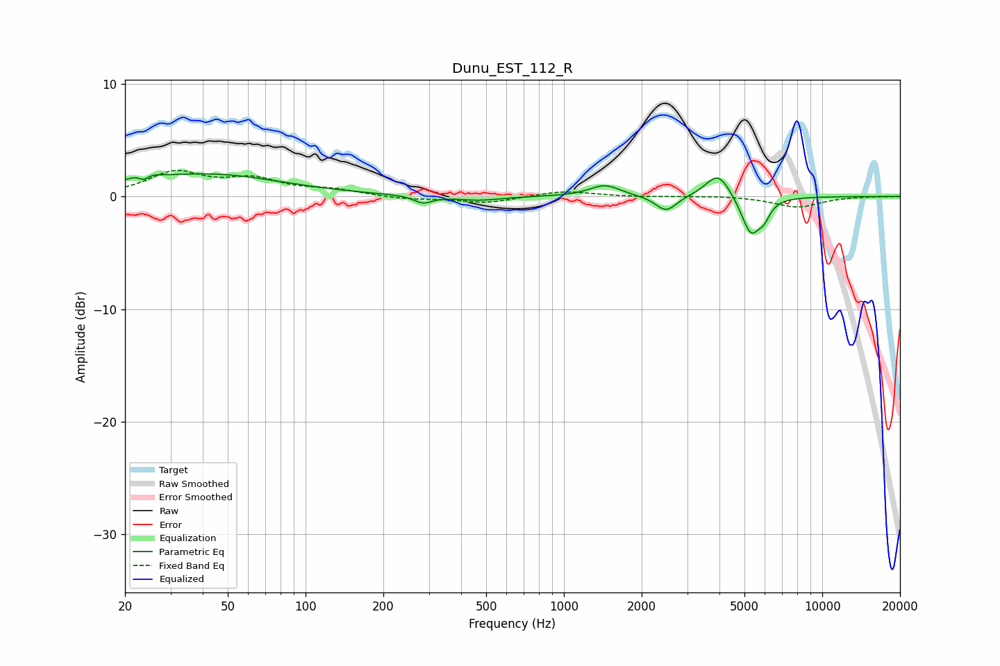

# Dunu_EST_112_R
See [usage instructions](https://github.com/jaakkopasanen/AutoEq#usage) for more options and info.

### Parametric EQs
Apply preamp of -2.1 dB when using parametric equalizer.

|   # | Type    |   Fc (Hz) |    Q |   Gain (dB) |
|-----|---------|-----------|------|-------------|
|   1 | Peaking |        24 | 3.81 |         1.6 |
|   2 | Peaking |        24 | 5.43 |        -1.6 |
|   3 | Peaking |        41 | 0.49 |         2   |
|   4 | Peaking |       285 | 4.14 |        -0.7 |
|   5 | Peaking |       467 | 1.63 |        -0.4 |
|   6 | Peaking |      1441 | 2.38 |         1   |
|   7 | Peaking |      2489 | 3.47 |        -1.4 |
|   8 | Peaking |      3954 | 2.91 |         2.2 |
|   9 | Peaking |      5294 | 3.77 |        -3.4 |
|  10 | Peaking |      5958 | 6    |        -1.1 |

### Fixed Band EQs
When using fixed band (also called graphic) equalizer, apply preamp of **-2.4 dB** (if available) and set gains manually with these parameters.

|   # | Type    |   Fc (Hz) |    Q |   Gain (dB) |
|-----|---------|-----------|------|-------------|
|   1 | Peaking |        31 | 1.41 |         2   |
|   2 | Peaking |        62 | 1.41 |         1.4 |
|   3 | Peaking |       125 | 1.41 |         0.5 |
|   4 | Peaking |       250 | 1.41 |        -0.2 |
|   5 | Peaking |       500 | 1.41 |        -0.6 |
|   6 | Peaking |      1000 | 1.41 |         0.5 |
|   7 | Peaking |      2000 | 1.41 |        -0   |
|   8 | Peaking |      4000 | 1.41 |         0.1 |
|   9 | Peaking |      8000 | 1.41 |        -0.9 |
|  10 | Peaking |     16000 | 1.41 |         0   |

### Graphs

