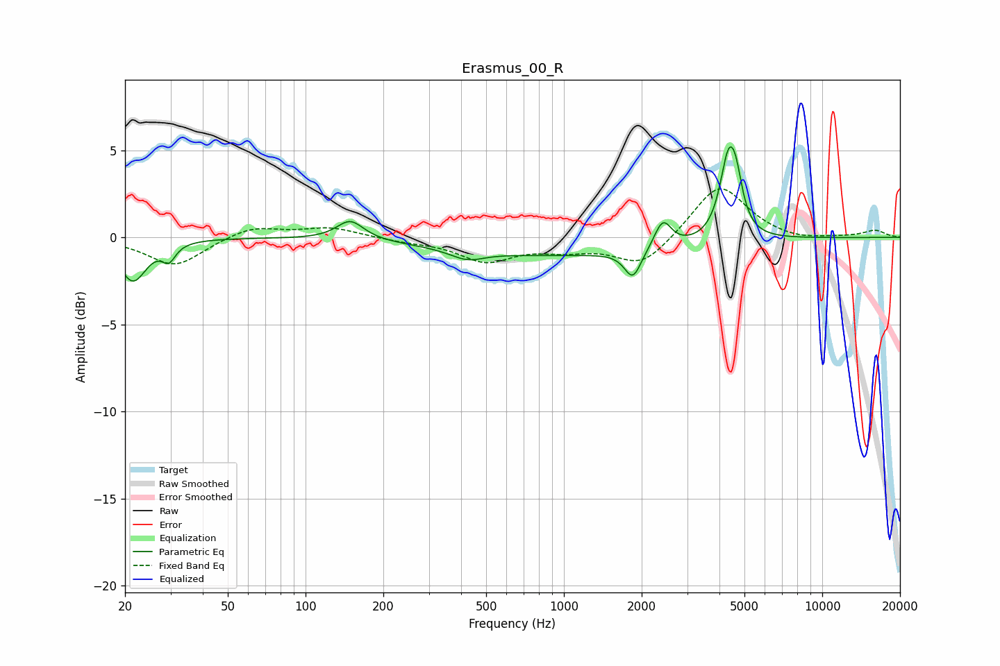

# Erasmus_00_R
See [usage instructions](https://github.com/jaakkopasanen/AutoEq#usage) for more options and info.

### Parametric EQs
Apply preamp of -5.3 dB when using parametric equalizer.

|   # | Type    |   Fc (Hz) |    Q |   Gain (dB) |
|-----|---------|-----------|------|-------------|
|   1 | Peaking |        21 | 2.77 |        -2.4 |
|   2 | Peaking |        30 | 5.73 |        -0.9 |
|   3 | Peaking |       149 | 2.71 |         1.1 |
|   4 | Peaking |       423 | 2.18 |        -0.6 |
|   5 | Peaking |       969 | 0.32 |        -1   |
|   6 | Peaking |      1845 | 5.01 |        -0.6 |
|   7 | Peaking |      1854 | 4    |        -1   |
|   8 | Peaking |      2414 | 4.3  |         1.6 |
|   9 | Peaking |      4334 | 4.28 |         4.4 |
|  10 | Peaking |      4644 | 5.77 |         1.8 |

### Fixed Band EQs
When using fixed band (also called graphic) equalizer, apply preamp of **-2.9 dB** (if available) and set gains manually with these parameters.

|   # | Type    |   Fc (Hz) |    Q |   Gain (dB) |
|-----|---------|-----------|------|-------------|
|   1 | Peaking |        31 | 1.41 |        -1.7 |
|   2 | Peaking |        62 | 1.41 |         0.7 |
|   3 | Peaking |       125 | 1.41 |         0.6 |
|   4 | Peaking |       250 | 1.41 |        -0.2 |
|   5 | Peaking |       500 | 1.41 |        -1.3 |
|   6 | Peaking |      1000 | 1.41 |        -0.6 |
|   7 | Peaking |      2000 | 1.41 |        -1.7 |
|   8 | Peaking |      4000 | 1.41 |         3.1 |
|   9 | Peaking |      8000 | 1.41 |        -0.2 |
|  10 | Peaking |     16000 | 1.41 |         0.4 |

### Graphs

