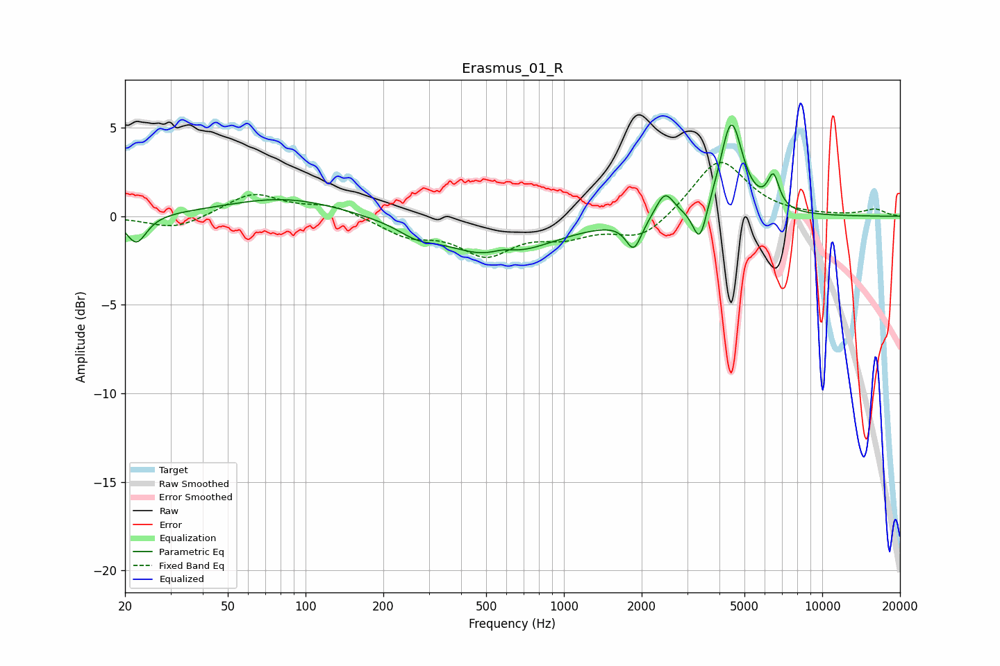

# Erasmus_01_R
See [usage instructions](https://github.com/jaakkopasanen/AutoEq#usage) for more options and info.

### Parametric EQs
Apply preamp of -5.3 dB when using parametric equalizer.

|   # | Type    |   Fc (Hz) |    Q |   Gain (dB) |
|-----|---------|-----------|------|-------------|
|   1 | Peaking |        22 | 3.63 |        -1.6 |
|   2 | Peaking |        83 | 0.63 |         1.1 |
|   3 | Peaking |       268 | 2.07 |        -0.5 |
|   4 | Peaking |       547 | 0.7  |        -2.3 |
|   5 | Peaking |       581 | 2.83 |         0.4 |
|   6 | Peaking |      1865 | 4.69 |        -1.7 |
|   7 | Peaking |      2460 | 4.05 |         1.5 |
|   8 | Peaking |      3359 | 5.3  |        -2.2 |
|   9 | Peaking |      4448 | 3.25 |         5.3 |
|  10 | Peaking |      6471 | 6    |         1.8 |

### Fixed Band EQs
When using fixed band (also called graphic) equalizer, apply preamp of **-3.1 dB** (if available) and set gains manually with these parameters.

|   # | Type    |   Fc (Hz) |    Q |   Gain (dB) |
|-----|---------|-----------|------|-------------|
|   1 | Peaking |        31 | 1.41 |        -0.8 |
|   2 | Peaking |        62 | 1.41 |         1.3 |
|   3 | Peaking |       125 | 1.41 |         0.6 |
|   4 | Peaking |       250 | 1.41 |        -1   |
|   5 | Peaking |       500 | 1.41 |        -2   |
|   6 | Peaking |      1000 | 1.41 |        -0.9 |
|   7 | Peaking |      2000 | 1.41 |        -1.3 |
|   8 | Peaking |      4000 | 1.41 |         3.3 |
|   9 | Peaking |      8000 | 1.41 |         0   |
|  10 | Peaking |     16000 | 1.41 |         0.4 |

### Graphs

