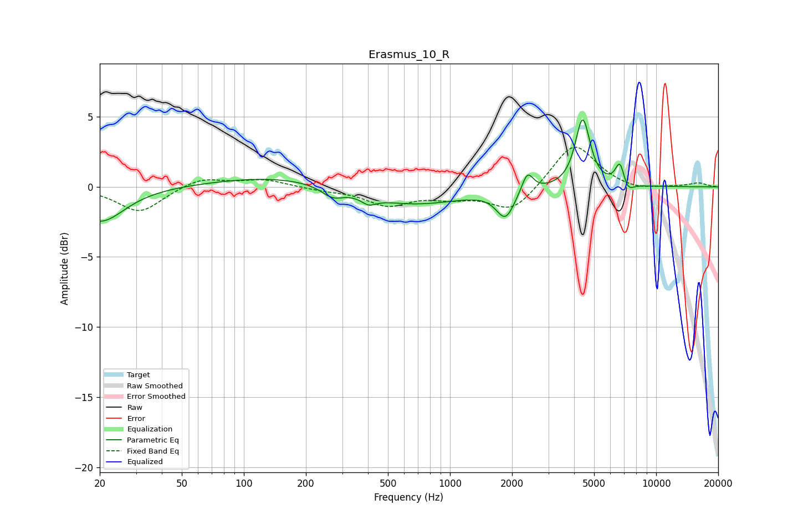

# Erasmus_10_R
See [usage instructions](https://github.com/jaakkopasanen/AutoEq#usage) for more options and info.

### Parametric EQs
Apply preamp of -4.9 dB when using parametric equalizer.

|   # | Type    |   Fc (Hz) |    Q |   Gain (dB) |
|-----|---------|-----------|------|-------------|
|   1 | Peaking |        20 | 1.22 |        -2.5 |
|   2 | Peaking |       151 | 0.45 |         0.8 |
|   3 | Peaking |       269 | 2.69 |        -0.7 |
|   4 | Peaking |       403 | 3.89 |        -0.5 |
|   5 | Peaking |       645 | 0.57 |        -1.3 |
|   6 | Peaking |      1858 | 3.23 |        -2   |
|   7 | Peaking |      2375 | 5.13 |         1.4 |
|   8 | Peaking |      4402 | 3.99 |         4.9 |
|   9 | Peaking |      6682 | 5.99 |         1.7 |
|  10 | Peaking |      7245 | 4.89 |        -0.8 |

### Fixed Band EQs
When using fixed band (also called graphic) equalizer, apply preamp of **-2.9 dB** (if available) and set gains manually with these parameters.

|   # | Type    |   Fc (Hz) |    Q |   Gain (dB) |
|-----|---------|-----------|------|-------------|
|   1 | Peaking |        31 | 1.41 |        -1.8 |
|   2 | Peaking |        62 | 1.41 |         0.7 |
|   3 | Peaking |       125 | 1.41 |         0.5 |
|   4 | Peaking |       250 | 1.41 |        -0.2 |
|   5 | Peaking |       500 | 1.41 |        -1.2 |
|   6 | Peaking |      1000 | 1.41 |        -0.6 |
|   7 | Peaking |      2000 | 1.41 |        -1.8 |
|   8 | Peaking |      4000 | 1.41 |         3.2 |
|   9 | Peaking |      8000 | 1.41 |        -0.3 |
|  10 | Peaking |     16000 | 1.41 |         0.3 |

### Graphs

