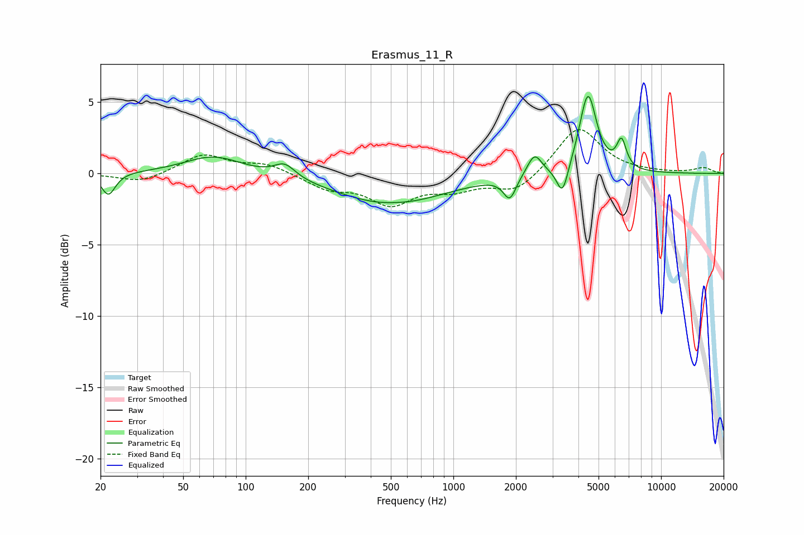

# Erasmus_11_R
See [usage instructions](https://github.com/jaakkopasanen/AutoEq#usage) for more options and info.

### Parametric EQs
Apply preamp of -5.5 dB when using parametric equalizer.

|   # | Type    |   Fc (Hz) |    Q |   Gain (dB) |
|-----|---------|-----------|------|-------------|
|   1 | Peaking |        22 | 4.33 |        -1.6 |
|   2 | Peaking |        70 | 1.02 |         1.3 |
|   3 | Peaking |       154 | 2.77 |         1   |
|   4 | Peaking |       497 | 0.55 |        -2.1 |
|   5 | Peaking |       518 | 2.02 |         0.1 |
|   6 | Peaking |      1869 | 4.71 |        -1.6 |
|   7 | Peaking |      2458 | 4.05 |         1.5 |
|   8 | Peaking |      3351 | 5.13 |        -2.1 |
|   9 | Peaking |      4446 | 3.45 |         5.6 |
|  10 | Peaking |      6450 | 6    |         1.9 |

### Fixed Band EQs
When using fixed band (also called graphic) equalizer, apply preamp of **-3.2 dB** (if available) and set gains manually with these parameters.

|   # | Type    |   Fc (Hz) |    Q |   Gain (dB) |
|-----|---------|-----------|------|-------------|
|   1 | Peaking |        31 | 1.41 |        -0.7 |
|   2 | Peaking |        62 | 1.41 |         1.3 |
|   3 | Peaking |       125 | 1.41 |         0.7 |
|   4 | Peaking |       250 | 1.41 |        -1   |
|   5 | Peaking |       500 | 1.41 |        -2   |
|   6 | Peaking |      1000 | 1.41 |        -0.9 |
|   7 | Peaking |      2000 | 1.41 |        -1.3 |
|   8 | Peaking |      4000 | 1.41 |         3.3 |
|   9 | Peaking |      8000 | 1.41 |         0   |
|  10 | Peaking |     16000 | 1.41 |         0.4 |

### Graphs

