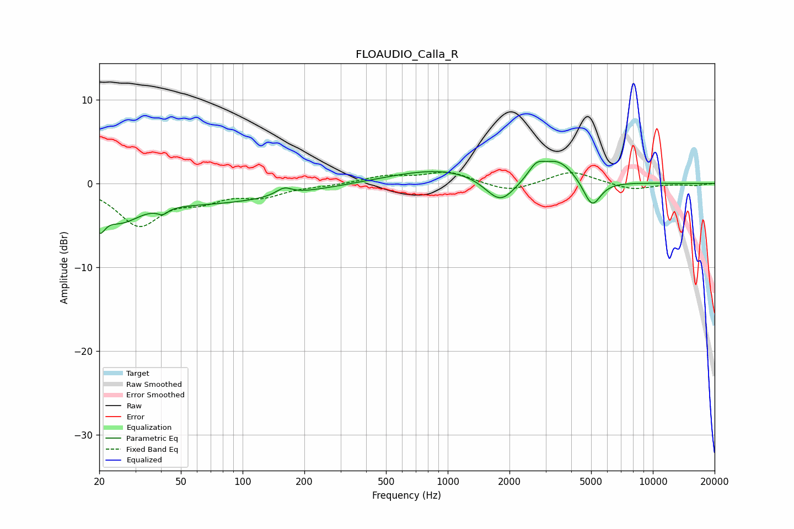

# FLOAUDIO_Calla_R
See [usage instructions](https://github.com/jaakkopasanen/AutoEq#usage) for more options and info.

### Parametric EQs
Apply preamp of -2.7 dB when using parametric equalizer.

|   # | Type    |   Fc (Hz) |    Q |   Gain (dB) |
|-----|---------|-----------|------|-------------|
|   1 | Peaking |        20 | 5.16 |        -2.8 |
|   2 | Peaking |        25 | 1.53 |        -2.7 |
|   3 | Peaking |        41 | 5.75 |        -0.7 |
|   4 | Peaking |        62 | 0.32 |        -2.3 |
|   5 | Peaking |       159 | 3.65 |         0.9 |
|   6 | Peaking |       940 | 0.56 |         1.8 |
|   7 | Peaking |      1805 | 1.9  |        -3.2 |
|   8 | Peaking |      2700 | 3.71 |         1.5 |
|   9 | Peaking |      3452 | 1.72 |         2.7 |
|  10 | Peaking |      5049 | 3.3  |        -3.3 |

### Fixed Band EQs
When using fixed band (also called graphic) equalizer, apply preamp of **-1.5 dB** (if available) and set gains manually with these parameters.

|   # | Type    |   Fc (Hz) |    Q |   Gain (dB) |
|-----|---------|-----------|------|-------------|
|   1 | Peaking |        31 | 1.41 |        -4.8 |
|   2 | Peaking |        62 | 1.41 |        -1.6 |
|   3 | Peaking |       125 | 1.41 |        -1.3 |
|   4 | Peaking |       250 | 1.41 |        -0.2 |
|   5 | Peaking |       500 | 1.41 |         0.9 |
|   6 | Peaking |      1000 | 1.41 |         1.4 |
|   7 | Peaking |      2000 | 1.41 |        -1.1 |
|   8 | Peaking |      4000 | 1.41 |         1.5 |
|   9 | Peaking |      8000 | 1.41 |        -0.8 |
|  10 | Peaking |     16000 | 1.41 |        -0.2 |

### Graphs

