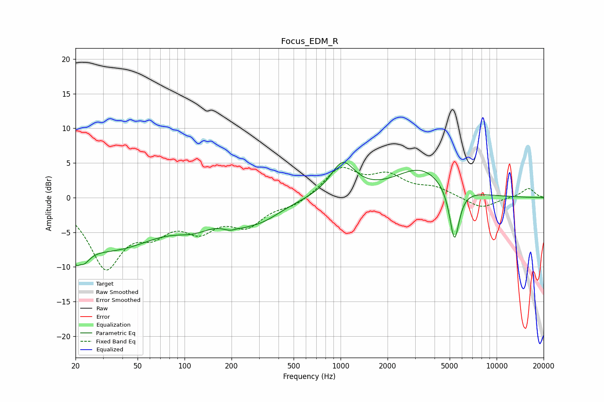

# Focus_EDM_R
See [usage instructions](https://github.com/jaakkopasanen/AutoEq#usage) for more options and info.

### Parametric EQs
Apply preamp of -5.2 dB when using parametric equalizer.

|   # | Type    |   Fc (Hz) |    Q |   Gain (dB) |
|-----|---------|-----------|------|-------------|
|   1 | Peaking |        21 | 3.56 |        -7.1 |
|   2 | Peaking |        21 | 5.71 |         3.4 |
|   3 | Peaking |        34 | 0.44 |        -7.1 |
|   4 | Peaking |       116 | 1.17 |        -2.1 |
|   5 | Peaking |       210 | 2.51 |        -4.5 |
|   6 | Peaking |       212 | 3.01 |         3.1 |
|   7 | Peaking |       304 | 1.01 |        -2.7 |
|   8 | Peaking |      1030 | 1.8  |         4.8 |
|   9 | Peaking |      3267 | 0.84 |         4.1 |
|  10 | Peaking |      5365 | 4.37 |        -8   |

### Fixed Band EQs
When using fixed band (also called graphic) equalizer, apply preamp of **-4.5 dB** (if available) and set gains manually with these parameters.

|   # | Type    |   Fc (Hz) |    Q |   Gain (dB) |
|-----|---------|-----------|------|-------------|
|   1 | Peaking |        31 | 1.41 |        -9.6 |
|   2 | Peaking |        62 | 1.41 |        -3.6 |
|   3 | Peaking |       125 | 1.41 |        -3.9 |
|   4 | Peaking |       250 | 1.41 |        -3.6 |
|   5 | Peaking |       500 | 1.41 |        -1.1 |
|   6 | Peaking |      1000 | 1.41 |         4.1 |
|   7 | Peaking |      2000 | 1.41 |         2.8 |
|   8 | Peaking |      4000 | 1.41 |         1.3 |
|   9 | Peaking |      8000 | 1.41 |        -1.6 |
|  10 | Peaking |     16000 | 1.41 |         1.4 |

### Graphs

