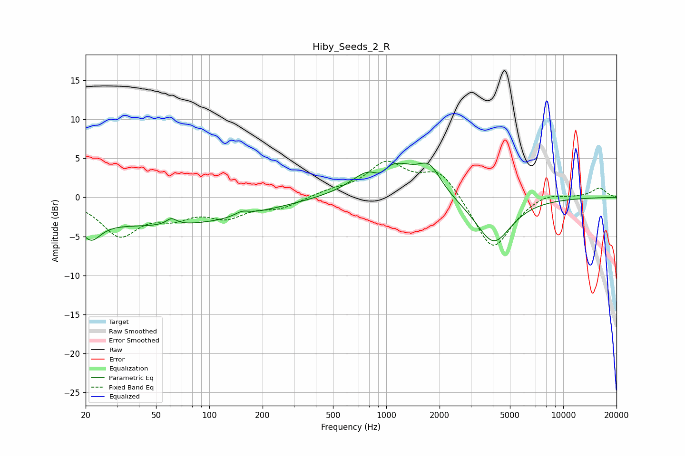

# Hiby_Seeds_2_R
See [usage instructions](https://github.com/jaakkopasanen/AutoEq#usage) for more options and info.

### Parametric EQs
Apply preamp of -4.5 dB when using parametric equalizer.

|   # | Type    |   Fc (Hz) |    Q |   Gain (dB) |
|-----|---------|-----------|------|-------------|
|   1 | Peaking |        21 | 2.57 |        -2.7 |
|   2 | Peaking |        52 | 0.26 |        -3.6 |
|   3 | Peaking |        61 | 4.88 |         0.9 |
|   4 | Peaking |       153 | 3.58 |         0.6 |
|   5 | Peaking |       900 | 1.23 |         4.6 |
|   6 | Peaking |       919 | 2.9  |        -2.4 |
|   7 | Peaking |      1072 | 1.77 |         0.9 |
|   8 | Peaking |      1303 | 1.85 |         0.9 |
|   9 | Peaking |      1750 | 2.12 |         3.4 |
|  10 | Peaking |      4036 | 1.4  |        -5.9 |

### Fixed Band EQs
When using fixed band (also called graphic) equalizer, apply preamp of **-4.7 dB** (if available) and set gains manually with these parameters.

|   # | Type    |   Fc (Hz) |    Q |   Gain (dB) |
|-----|---------|-----------|------|-------------|
|   1 | Peaking |        31 | 1.41 |        -4.7 |
|   2 | Peaking |        62 | 1.41 |        -2   |
|   3 | Peaking |       125 | 1.41 |        -2.2 |
|   4 | Peaking |       250 | 1.41 |        -1.2 |
|   5 | Peaking |       500 | 1.41 |         0.7 |
|   6 | Peaking |      1000 | 1.41 |         4.2 |
|   7 | Peaking |      2000 | 1.41 |         3.5 |
|   8 | Peaking |      4000 | 1.41 |        -7   |
|   9 | Peaking |      8000 | 1.41 |         0.8 |
|  10 | Peaking |     16000 | 1.41 |         1.2 |

### Graphs

