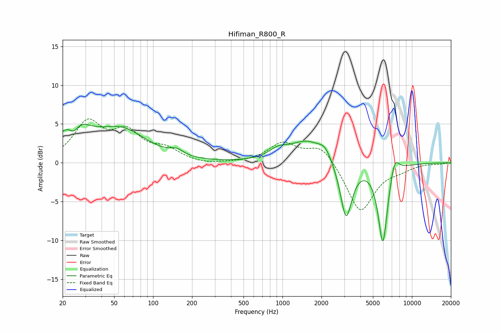

# Hifiman_R800_R
See [usage instructions](https://github.com/jaakkopasanen/AutoEq#usage) for more options and info.

### Parametric EQs
Apply preamp of -5.0 dB when using parametric equalizer.

|   # | Type    |   Fc (Hz) |    Q |   Gain (dB) |
|-----|---------|-----------|------|-------------|
|   1 | Peaking |        24 | 1.31 |         4.9 |
|   2 | Peaking |        24 | 3.38 |        -2.1 |
|   3 | Peaking |        57 | 0.73 |         4   |
|   4 | Peaking |       152 | 2.8  |         0.7 |
|   5 | Peaking |       927 | 2    |         1.1 |
|   6 | Peaking |      1552 | 1.07 |         2.7 |
|   7 | Peaking |      2131 | 3    |         1.3 |
|   8 | Peaking |      3099 | 3.12 |        -7.4 |
|   9 | Peaking |      5958 | 3.73 |       -10.4 |
|  10 | Peaking |      7364 | 4.1  |         2.4 |

### Fixed Band EQs
When using fixed band (also called graphic) equalizer, apply preamp of **-5.8 dB** (if available) and set gains manually with these parameters.

|   # | Type    |   Fc (Hz) |    Q |   Gain (dB) |
|-----|---------|-----------|------|-------------|
|   1 | Peaking |        31 | 1.41 |         4.9 |
|   2 | Peaking |        62 | 1.41 |         3.5 |
|   3 | Peaking |       125 | 1.41 |         1.5 |
|   4 | Peaking |       250 | 1.41 |        -0.3 |
|   5 | Peaking |       500 | 1.41 |        -0   |
|   6 | Peaking |      1000 | 1.41 |         2.5 |
|   7 | Peaking |      2000 | 1.41 |         2.4 |
|   8 | Peaking |      4000 | 1.41 |        -6.4 |
|   9 | Peaking |      8000 | 1.41 |        -0.6 |
|  10 | Peaking |     16000 | 1.41 |        -0.1 |

### Graphs

