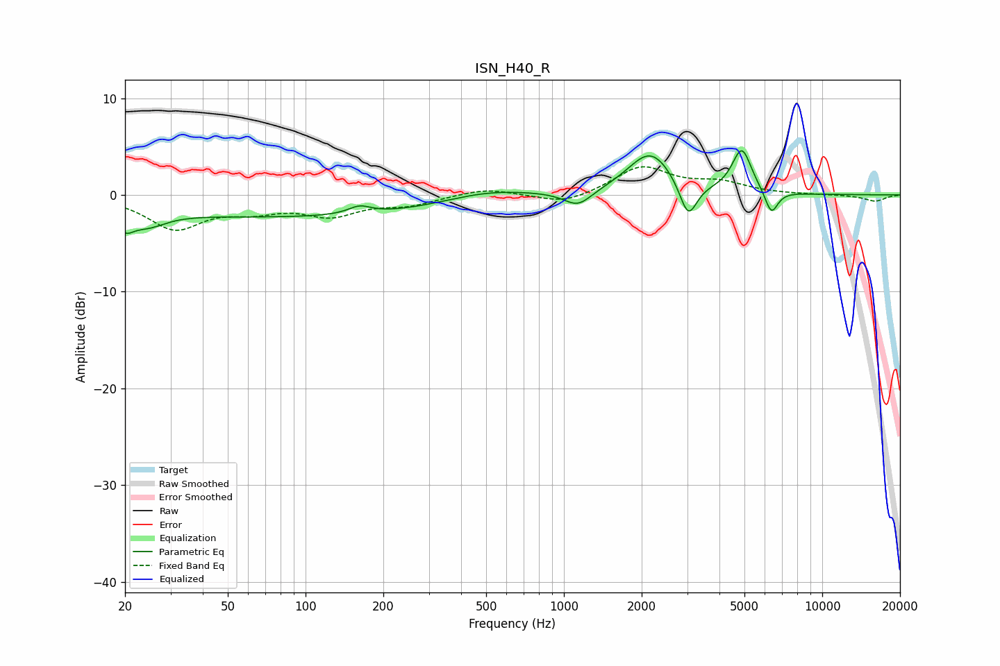

# ISN_H40_R
See [usage instructions](https://github.com/jaakkopasanen/AutoEq#usage) for more options and info.

### Parametric EQs
Apply preamp of -4.6 dB when using parametric equalizer.

|   # | Type    |   Fc (Hz) |    Q |   Gain (dB) |
|-----|---------|-----------|------|-------------|
|   1 | Peaking |        20 | 4.47 |        -1.6 |
|   2 | Peaking |        24 | 1.87 |        -1.6 |
|   3 | Peaking |        98 | 0.19 |        -2.3 |
|   4 | Peaking |       162 | 3.25 |         0.8 |
|   5 | Peaking |       498 | 0.76 |         1.3 |
|   6 | Peaking |      1134 | 2.62 |        -1.6 |
|   7 | Peaking |      2165 | 1.61 |         4.5 |
|   8 | Peaking |      3028 | 4.18 |        -3.8 |
|   9 | Peaking |      4883 | 3.74 |         4.6 |
|  10 | Peaking |      6355 | 5.5  |        -2.5 |

### Fixed Band EQs
When using fixed band (also called graphic) equalizer, apply preamp of **-3.0 dB** (if available) and set gains manually with these parameters.

|   # | Type    |   Fc (Hz) |    Q |   Gain (dB) |
|-----|---------|-----------|------|-------------|
|   1 | Peaking |        31 | 1.41 |        -3.4 |
|   2 | Peaking |        62 | 1.41 |        -1.3 |
|   3 | Peaking |       125 | 1.41 |        -1.9 |
|   4 | Peaking |       250 | 1.41 |        -0.9 |
|   5 | Peaking |       500 | 1.41 |         0.7 |
|   6 | Peaking |      1000 | 1.41 |        -1   |
|   7 | Peaking |      2000 | 1.41 |         2.9 |
|   8 | Peaking |      4000 | 1.41 |         1.1 |
|   9 | Peaking |      8000 | 1.41 |         0   |
|  10 | Peaking |     16000 | 1.41 |        -0.7 |

### Graphs

