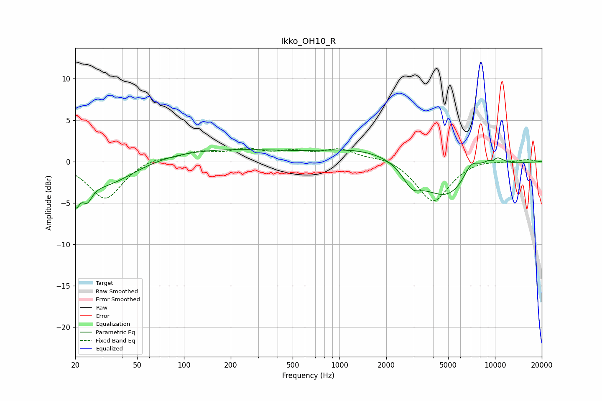

# Ikko_OH10_R
See [usage instructions](https://github.com/jaakkopasanen/AutoEq#usage) for more options and info.

### Parametric EQs
Apply preamp of -1.5 dB when using parametric equalizer.

|   # | Type    |   Fc (Hz) |    Q |   Gain (dB) |
|-----|---------|-----------|------|-------------|
|   1 | Peaking |        20 | 5.87 |        -3   |
|   2 | Peaking |        24 | 4.47 |        -2   |
|   3 | Peaking |        31 | 0.71 |        -3.2 |
|   4 | Peaking |       146 | 0.28 |         1.5 |
|   5 | Peaking |      1677 | 0.47 |         1.8 |
|   6 | Peaking |      2928 | 2.42 |        -2   |
|   7 | Peaking |      4894 | 0.76 |        -5   |
|   8 | Peaking |      7031 | 2.41 |         2.3 |
|   9 | Peaking |      9687 | 5.99 |        -0.7 |
|  10 | Peaking |      9792 | 1.97 |         1.9 |

### Fixed Band EQs
When using fixed band (also called graphic) equalizer, apply preamp of **-1.7 dB** (if available) and set gains manually with these parameters.

|   # | Type    |   Fc (Hz) |    Q |   Gain (dB) |
|-----|---------|-----------|------|-------------|
|   1 | Peaking |        31 | 1.41 |        -4.6 |
|   2 | Peaking |        62 | 1.41 |         0.6 |
|   3 | Peaking |       125 | 1.41 |         1.1 |
|   4 | Peaking |       250 | 1.41 |         1.2 |
|   5 | Peaking |       500 | 1.41 |         1   |
|   6 | Peaking |      1000 | 1.41 |         1.4 |
|   7 | Peaking |      2000 | 1.41 |         0.6 |
|   8 | Peaking |      4000 | 1.41 |        -4.9 |
|   9 | Peaking |      8000 | 1.41 |         0.3 |
|  10 | Peaking |     16000 | 1.41 |         0.3 |

### Graphs

